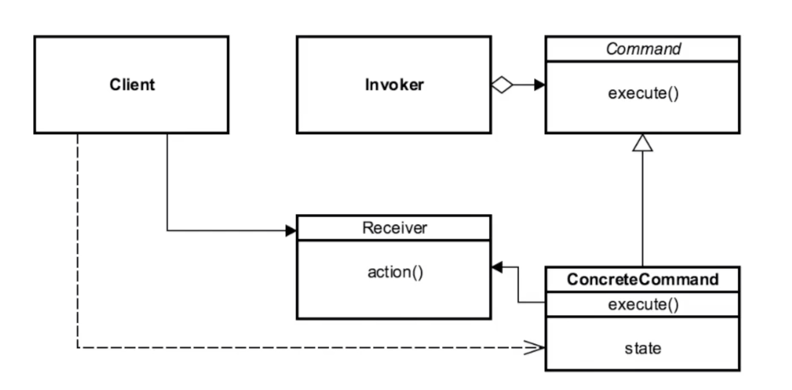

# Command 

## Introduction
encapsulate each request as an object.

## Concepts
- encapsulates each request as an object
    - simplicity
- allows callbacks to be Object-Oriented
- sender is decoupled from processor
    - flexibility/extensibility
- often used for "undo" functionality
    - compensating command/transactions
    
EXAMPLES
- java.lang.Runnable
- javax.swing.Action

## Design Considerations

- "breaks OOP"
    - Object per command
- Command Interface
    - main contract
    - all commands implement it
    - in simplest form contains Execute Method
- Execute Method
    - business logc
- Unexecute Method
    - undoes execute
- Reflection (Advanced) 
    - decouples client from receiver/processor using a callback
    
CLIENT
- works /w invoker to "issue a command"
- the "action" is decoupled from the client.
    
COMMAND
- heart of pattern
- provides structure for invoker to abstractly execute on
concrete commands

INVOKER

CONCRETE COMMAND

RECEIVER
- action method that the Execute Method is performed on.

## Pitfalls
- dependence on other patterns
- multiple commands
    - instead of trying to create multiple commands w/ different functionality, look at
        - COMPOSITE
        - CHAIN OF RESPONSIBILITY
- Undo
    - LOOK at MEMENTO
- if you want copies
    - PROTOTYPE

## Contrast to Other Patterns

| COMMAND | STRATEGY |
| --- | --- |
| Object per commmand | Object per strategy | 
| Class contains "what we are trying do" |  class contains the "how we are doing it" | 
| encapsulates ENTIRE action | encapsulates the ALGORITHM | 

very similar w/ slight variations

## Summary
- one of the most common patterns
- encapsulates each request as an object
- decouples sender from processor (the action, or the executor)
    - main reason for using this pattern
- very few drawbacks
- often used for UNDO functionality

