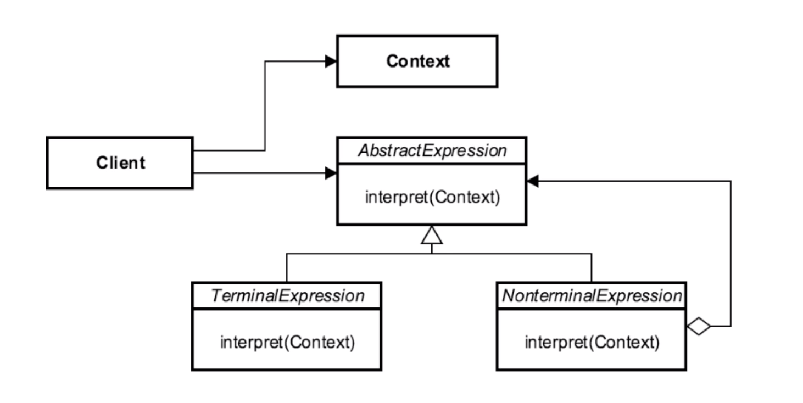

# Interpreter 

## Introduction
used to represent the grammar of a language

## Concepts
- represents a grammar
    - math
    - language
    - music notation
    - source code parsing
- interpretation of a sentence/phrase/statement
- map DSL
- AST (Abstract Syntax Tree)

EXAMPLE:
- java.util.Pattern
- java.text.Format (locale specific content)

## Design Considerations

- AbstractExpression (ABC) 
    - declares interface for exec'ing operation
- Interpret (Method)
    - "the operation"
- TerminalExpression
    - leaf of a tree 
- NonterminalExpression
    - compound expressions that contain other expressions
    
CONTEXT
- contains data/state global to interpreter
- all expressions extend from ABSTRACT EXPRESSION

ABSTRACT EXPRESSION
- provides contract for interaction

TERMINAL EXPRESSION
- expressions can be evaluated in their current form

NONTERMINAL EXPRESSION
- expressions that require reinterpretation
    - recurses until it reaches a  terminal expression

CLIENT
- builds expression instances (terminal/nonterminal)

## Pitfalls
- complex grammar makes the pattern difficult to maintain
- at least 1 class per rule
    - lots of objects
- use of other patterns
- adding new variant
- specific use case
    - most patterns have a wider set of use cases

## Contrast to Other Patterns

| INTERPRETER | VISITOR |
| --- | --- |
| access to properties | needs Observer functionality | 
| functions defined as methods | functionality is found in one place | 
| adding new functionality changes every variant| adding new variants, requires changing every visitor  | 

## Summary
- define a grammar
- rules/Validation criteria
- special case/limited use pattern
- consider the visitor

