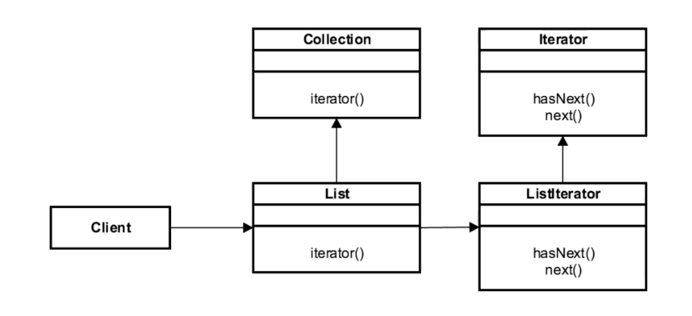

# Iterator 

## Introduction
Great pattern for providing navigation w/o exposing 
the structure of the object

## Concepts
- traverse storage container
- do NOT expose underlying structure
    - different structures have different algorithms/procedures
- decouples algorithms 
- sequential in nature
EXAMPLES:
- java.util.Iterator
- java.util.Enumeration

## Design Considerations

- interface based
- factory method based
- iterators are independent of each other
- fail-fast (Concurrent Modification)
    - 2 iterators can't modify the underlying objects w/o throwing an exception
- enumerators are fail safe
    - can't be used to fail. 

## Pitfalls
- no access to index 
    - similar to linked list, you have to traverse to get
    what you are looking for
    - moot point for sets/maps that don't have indexes
- directional
    - forward only
    - (listIterator is BIDIRECTIONAL)
- Speed/Efficiency
    - sometimes slower than "just using an index"
    - in MOST cases, larger structures, the iterator is the
    fastest way

## Contrast to Other Patterns

| ITERATOR | FOR LOOP |
| --- | --- |
| Interface Based  | | 
| Decouples traversal algorithm from client | client OWNS traversal code | 
| no index | exposes an index |
| helps with Concurrent Modification | doesn't/can't change underlying object  |
| supports forEach | no forEach | 
| | usually slower than iterator | 

## Summary
- efficient way to traverse an object
- hides algorithm from client 
    - adds simplicity to client 
- foreach syntax (simpler syntax)

