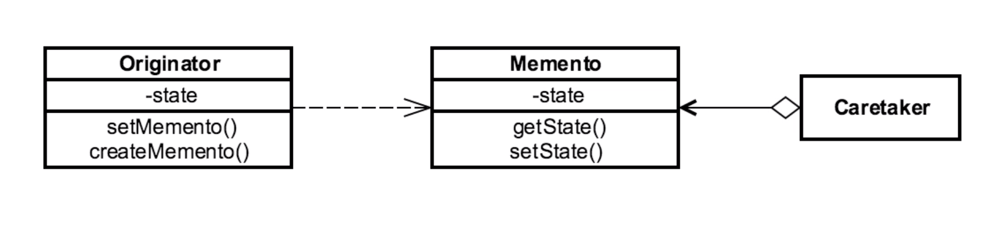

# MEMENTO 

## Introduction
used to externalize object state
(usually for rollback functionality)

## Concepts
- restore object to previous state
- externalize object's internal state
    - prevent violation of encapsulation
- Undo/Rollback functionality in applications
- shields complex internals

EXAMPLES:
- java.util.Date
- java.io.Serializable

## Design Considerations

Class-based 

ORIGINATOR:
- object whose state we want to save.
- copy me! roll me back!
- create/set memento 

CARETAKER
- manages copies/mementos we've saved
- "undo list"

MEMENTO
- copy of the original object we want to store
- Magic Cookie
    - combination of fields needed to recreate the object. 
    - stored in the Memento 

## Pitfalls
- expensive if memento is large copy of originators data
    - overhead
- caretaker has to consider history deletion
- be careful not to expose information from caretaker
    - security concerns

## Contrast to Other Patterns

| MEMENTO | COMMAND |
| --- | --- |
| captures state | captures requests | 
| independent instances of state | independent requests | 
| builds history (caretaker) | history side benefit (available, but usually not used)  | 

## Summary
- capture state
- can get heavy w/ large history
- recreate state of an object (undo/revert)
- similar (almost identical) to Command Pattern
    - Command is to requests as Memento is to state.