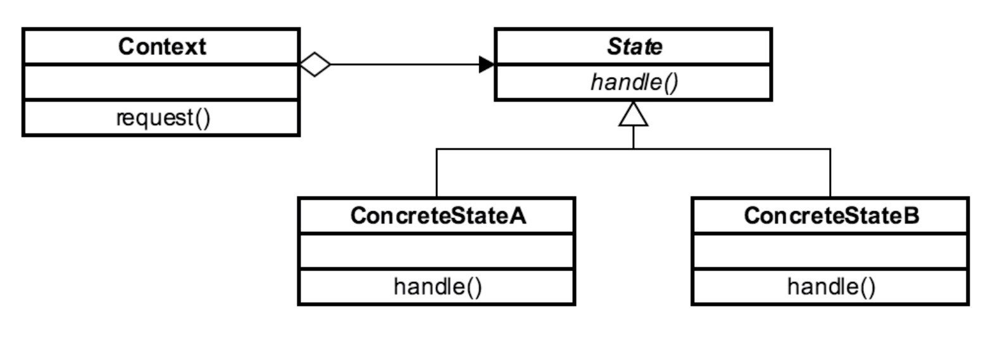

# State 

## Introduction
used when state needs to be represented in an application
(especially to remove/reduce cyclomatic complexity)

## Concepts
- localize state-specific behavior
    - current app state is stored in an object
- separates "what from where"
    - forces Open-Close Principle
    - closed for change, open for extensions
    
NO Java API Example
EXAMPLES:
- JSF

## Design Considerations

- abstract class/interface based
    - due to various states an object can be in
- each state is "class based"
    - implemented in a concrete state
- context unaware
- complexity comes in to play to remove if/else
    - reduces cyclomatic complexity

CONTEXT
- specific requests that are passed through state interface

STATE
- for each state app can be in there is a concrete state 

CONCRETE STATE

## Pitfalls
- must know all of the states of the application
- more classes than the method based approach
- must keep logic in state objects
    - must remain OUT OF THE CONTEXT
- must know what triggers state changes

## Contrast to Other Patterns

| STATE | STRATEGY |
| --- | --- |
| Interface based w/ a collection of concrete | Interface based  | 
| only knows about "next state" in can transition to | algorithms are independent from one another. (They don't know about the next state) |
| 1 class per state  | 1 class per algorithm | 

## Summary
- simplifies cyclomatic complexity
    - removes if/else spaghetti code
- simplifies adding/extending new states
- downside = proliferation of classes
    - usually isolated/contained, and fairly lightweight
- similar impl to Strategy
    - State is focused on state
    - Strategy is focused on algorithms.
