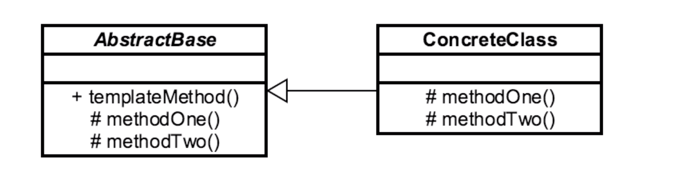

# Template Method 

## Introduction
Used to define an algo that allows subclasses to change parts of the algorithm
without changing its structure

## Concepts
- powerful technique to promote code reuse
- common in libraries/frameworks
- commonly used w/ IoC (Inversion of Control) frameworks
- algorithm emphasis

EXAMPLES:
- java.util.Collections#sort()
- java.util.AbstractList#indexOf()
v

## Design Considerations

- abstract base class
    - responsible for calling child class
    - hooks MAY be overridden
    - operations MUST be overridden
     
ABSTRACT BASE CLASS
- entry point/template method called by client lives here
- contains operations that must be OVERRIDDEN by concrete class

CONCRETE CLASS: 
- overrides operations (and optionally hooks) to complete algo 
defined in ABC

## Pitfalls
- restrict access to certain methods correctly
    - required methods must be final so that they can't be overridden. 
    - (i.e. the overall structure of the algorithm must remain the same)
- only individual methods/details (i.e. specific OPERATIONS) should be overridden
- confusing hierarchy
    - typically OOP doesn't impl algos across classes
- difficult program flow
    - can occur if there many different concrete classes

## Contrast to Other Patterns

| TEMPLATE METHOD | STRATEGY |
| --- | --- |
| same algorithm (different implementations)  | impl entire algorithm strategy | 
| class based | interface/contract based | 
| chosen at compile time | always used when also is chosen at runtime | 

## Summary
- guarantees algorithm adherence
- commonly used in inversion of control containers
    - "Hollywood Principle" (don't call us, we'll call you)
- easier impl than Strategy
    