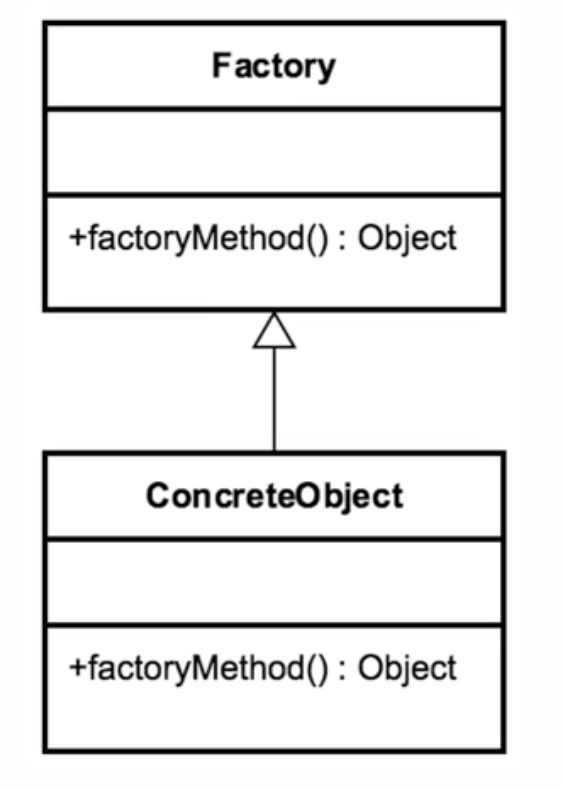

# Factory Method

## Introduction 
"Opposite" of Singleton

## Concepts
- Doesn't expose instantiation logic
- defers creation/instantiation logic to subclasses
- common interface
- specified by architecture, implemented by user
    - establishes a contract for how it is implemented in the framework at the
    same time providing flexibility to user to determine what is implemented
    
EXAMPLES
- Calendar
- ResourceBundle
- NumberFormat

## Design Considerations

- factory is reponsible for creating objects 
    - creation lifecycle
- common interface
- concrete classes
    - abstracted from client
- Parameterized creation method

## Pitfalls
- complexity
    - "double the amount of code"
    - creation doesn't take place in the Factory
        - it takes place in the subclass
    - Not refactored
        - typically part of initial planning

## Contrast to Other Patterns
| FACTORY | SINGLETON |
| --- | --- |
| Returns various instances   multiple constructors | Returns same instance   one constructor method - no args |
| Interface Driven | No interface |
| Adapts to environment more easily | |

## Summary
- parameter driven 
    - unlike Builder, which is a contract-driven pattern
- solves complex creation. 
- opposite of a Singleton.