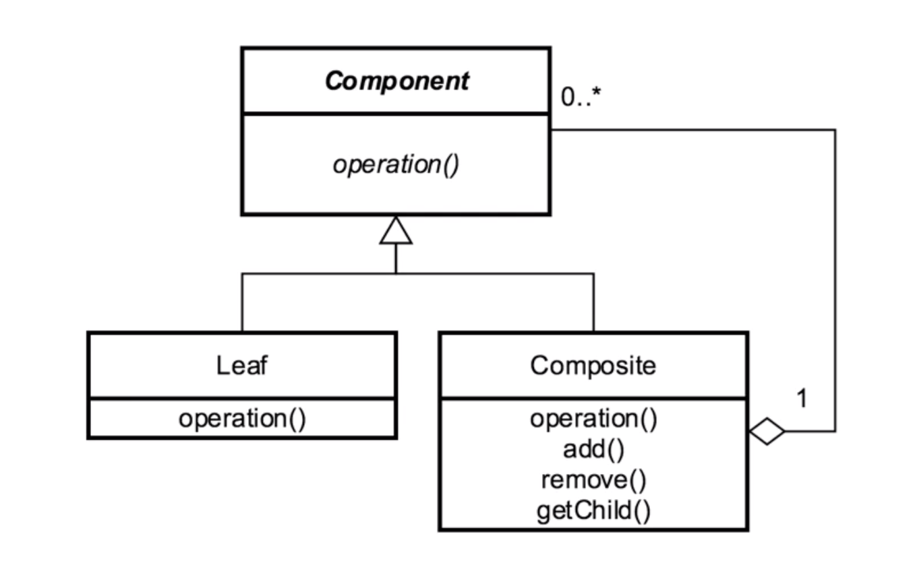

# Composite 

## Introduction
Hierarchical pattern that deals w/ tree structures

## Concepts
- designed to treat components the same whether or not they 
represent a part of the structure or the entire structure
    - part-whole hierarchy
- compose objects into tree structures
- allows treating objects as a Composite
    - same operations applied on individuals and composites
    
EXAMPLES:
- java.awt.Component
    - most of java.awt.* is built this way
- JSF Widgets
- RESTful service GETs

## Design Considerations

- Tree Structure
- Root = Component
    - Leaf or Composite
        - Leaf has operations
        - Composite has same operations
            - knows about its child components

COMPONENT
- abstraction for all composites/leafs

LEAF
- leaf/nodes in composition
- implements ALL components methods

COMPOSITE
- implements ALL components methods
    - usually delegates functionality
    to kids
- contains leafs
    - also has methods to manipulate childen

## Pitfalls
- overly simplify a system
- difficult to restrict
- runtime checks rather than compile time
safety due to simplicity and proliferation
- implementation can be very possibly
    - large composites
    - collections in collections

## Contrast to Other Patterns

| COMPOSITE | DECORATOR |
| --- | --- |
| Tree Structure | Contains another entity (composition), not composite| 
| Leaf and Composite have same interface to client | modifies behavior of the contained entity| 
| Unity between objects | doesn't change underlying object| 

## Summary
- generalizes a hierarchical structure
- can simplify things too much
    - leads to difficulties with restriction
- easier for clients
- Composite != Composition

COMPOSITE:
- pattern w/ a hierarchical structure

COMPOSITION:
- one object contains another.