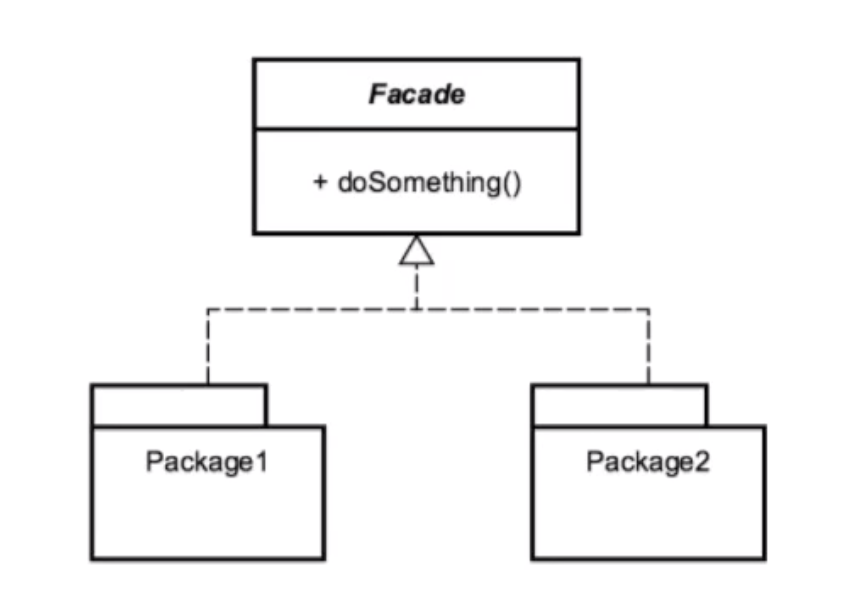

# Facade 

## Introduction
Simplified interface to a complex/difficult to use system
    - usually due to poor design

## Concepts
- aims to make an API easier to use
- reduces dependencies on outside code
- simplify interface or client usage
- usually a refactoring pattern

EXAMPLES:
- java.net.URL
- javax.faces.contextFacesContext (part of J2EE pattern)

## Design Considerations

- class that utilizes composition (almost entirely)
- shouldn't have a need for inheritance
- encompasses FULL lifecycle (usually)

FACADE
- wraps other APIs you are working with. 

UNDERLYING STUFF
- via composition, multiple other APIs/objects

## Pitfalls
- typically used to clean up shitty code
- if you are using it in a NEW API
    - rethink your design
- typically shouldn't use inheritance
    - flat structure + object composition
- often overused/misused due to simplicity
    - same issue as Singleton, so often called "Singleton" of Structural patterns
    

## Contrast to Other Patterns

| FACADE | ADAPTER |
| --- | --- |
| Simplifies an interface | "also a refactoring pattern" | 
| Works w/ composites | modifies/adding behavior | 
| provides cleaner API | provides a different interface to code | 

## Summary
- simplifies client interface
- easy pattern to implement
- refactoring pattern