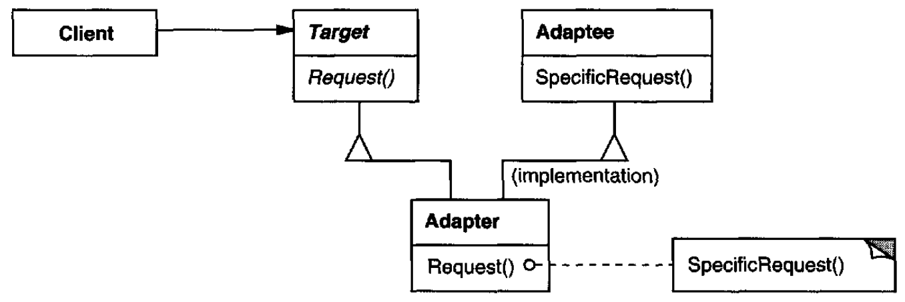
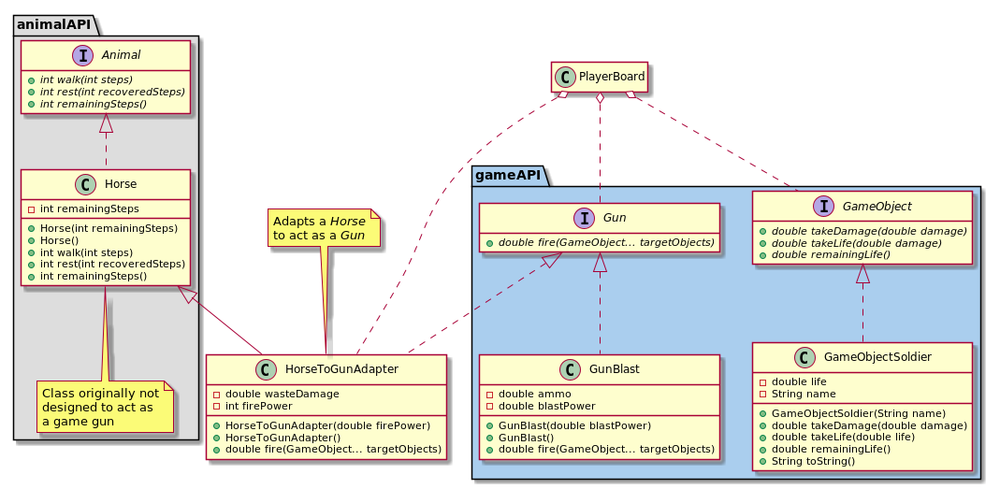
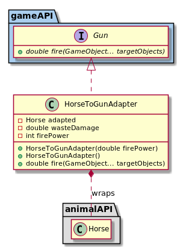

# Adapter

## Intent

Convert the interface of a class into another interface clients expect. Adapter lets classes work together that couldn't otherwise because of incompatible interfaces.

## Also Known As

Wrapper

## Applicability

* you want to use an existing class, and its interface does not match the one you need
* you want to create a reusable class that cooperates with unrelated or unforeseen classes, that is, classes that don't necessarily have compatible interfaces
* *(object adapter only)* you need to use several existing subclasses, but it's unpractical to adapt their interface by subclassing every one. An object adapter can adapt the interface of its parent class

## Structure

A class adapter uses multiple inheritance to adapt one interface to another:



An object adapter relies on object composition:


## Participants

* **`Target`**: defines the domain-specific interface that Client uses
* **`Client`**: collaborates with objects conforming to the Target interface
* **`Adaptec`**: defines an existing interface that needs adapting
* **`Adapter`**: adapts the interface of Adaptec to the Target interface

## Collaborations

*Client*s call operations on an *Adapter* instance. In turn, the adapter calls *Adaptee* operations that carry out the request.

## Consequences

* A class adapter
  - adapts Adaptee to Target by committing to a concrete Adaptee class. As a consequence, a class adapter won't work when we want to adapt a class *and* all its subclasses
  - lets Adapter override some of Adaptee's behavior, since Adapter is a subclass of Adaptee
  - introduces only one object, and no additional pointer indirection is needed to get to the adaptee
* An object adapter
  - lets a single Adapter work with many Adaptees—that is, the Adaptee itself and all of its subclasses (if any). The Adapter can also add functionality to all Adaptees at once
  - makes it harder to override Adaptee behavior. It will require subclassing Adaptee and making Adapter refer to the subclass rather than the Adaptee itself
  
## Related Patterns

*Bridge* has a structure similar to an *object adapter*, but *Bridge* has a different intent: It is meant to separate an interface from its implementation so that they can be varied easily and independently. An *adapter* is meant to change the interface of an existing object.

*Decorator* enhances another object without changing its interface. A decorator is thus more transparent to the application than an *adapter* is. As a consequence, *Decorator* supports recursive composition, which isn't possible with pure adapters.

*Proxy* defines a representative or surrogate for another object and does not change its interface.

## Example in Java

### *Class* Adapter



```java
package gameboard.animalAPI;

public interface Animal {
    /**
     * Walks some steps and dicreases how much more it can walk.
     *
     * @param steps Number of steps to walk.
     */
    int walk(int steps);

    /**
     * Make the animal to rest and recover so it can walk more in future.
     *
     * @param recoveredSteps Number of steps the animal will be able to walk even more after it rests.
     */
    int rest(int recoveredSteps);

    int remainingSteps();
}

public class Horse implements Animal {
    private int remainingSteps;

    public Horse(int remainingSteps) {
        this.remainingSteps = remainingSteps;
    }

    public Horse() {
        this(100);
    }

    @Override
    public synchronized int walk(int steps) {
        remainingSteps -= steps;
        return remainingSteps;
    }

    @Override
    public synchronized int rest(int recoveredSteps) {
        remainingSteps += recoveredSteps;
        return remainingSteps;
    }

    @Override
    public synchronized int remainingSteps() {
        return remainingSteps;
    }
}

package gameboard.gameAPI;

public interface GameObject {
    /**
     * Receives some action damage.
     *
     * @param damage Amount of damage to receive.
     * @return A Double indicating how much live is remaining for this object (how much more damage it can take before
     * being destroyed)
     */
    double takeDamage(double damage);

    /**
     * Receives some life points.
     *
     * @param life Amount of life to receive.
     * @return A Double indicating how much live is remaining for this object (how much more damage it can take before
     * being destroyed)
     */
    double takeLife(double life);

    double remainingLife();
}

public class GameObjectSoldier implements GameObject {
    private double life = 100d;
    private String name;

    public GameObjectSoldier(String name) {
        this.name = name;
    }

    @Override
    public synchronized double takeDamage(double damage) {
        life -= damage;
        return life;
    }

    @Override
    public synchronized double takeLife(double life) {
        this.life += life;
        return this.life;
    }

    @Override
    public synchronized double remainingLife() {
        return life;
    }

    @Override
    public String toString() {
        return "Soldier{name='" + name + "}";
    }
}

public interface Gun {
    /**
     * Does some damage to every target object taken as argument.
     *
     * @param targetObjects Target object fo make damage to.
     *
     * @return How much gun power is remaining.
     */
    double fire(GameObject... targetObjects);
}

public class GunBlast implements Gun {
    private double ammo = 1000;
    private double blastPower;

    public GunBlast(double blastPower) {
        this.blastPower = blastPower;
    }

    public GunBlast() {
        this(50);
    }

    @Override
    public synchronized double fire(GameObject... targetObjects) {
        int i = 0;
        while (ammo > 0 && i < targetObjects.length) {
            targetObjects[i++].takeDamage(blastPower);
            ammo -= blastPower;
        }
        return ammo;
    }
}

package gameboard

/**
 * Adapts a Horse implementation to behave like a Gun. That's it, now instances of this class are guns. See this like a
 * "War Horse".
 */
public class HorseToGunAdapter extends Horse implements Gun {
    private double wasteDamage;
    private int firePower;

    public HorseToGunAdapter(double firePower) {
        super((int) firePower);
        wasteDamage = firePower % (int)firePower;
        this.firePower = (int)firePower;
    }

    public HorseToGunAdapter() {
        this(100d);
    }

    @Override
    public synchronized double fire(GameObject... targetObjects) {
        int i = 0;
        while (remainingSteps() > 0 && i < targetObjects.length) {
            targetObjects[i++].takeDamage(firePower);
            walk(firePower);
        }
        return remainingSteps();
    }
}

public final class PlayerBoard {

    public static void main(String[] args) {
        GameObject[] gameObjects = {
                new GameObjectSoldier("Brian"),
                new GameObjectSoldier("John"),
                new GameObjectSoldier("Smith")
        };

        Gun gun = new GunBlast();
        gun.fire(gameObjects);

        HorseToGunAdapter warHorse = new HorseToGunAdapter();
        warHorse.fire(gameObjects); // adapted
        warHorse.walk(1);   // original method
    }
}
```

### *Object* Adapter

Taking as reference the preivous example, an object adapter variation would only differn in that now `HorseToGunAdapter` does not extends `Horse`, but holds an instance of `Horse`. This means it will be able to adapt, not only instaces of `Horse`, but instances of its subclasses too.

An example could be:



```java
public class HorseToGunAdapter implements Gun {
    private final Horse adapted;
    // ...
    
    public HorseToGunAdapter(double firePower) {
        this.adapted = new Horse((int) firePower);  // this can be replaced by any other means to create a new instance
                                                    // it can be even received as an argument
        // ...
    }
}
```
