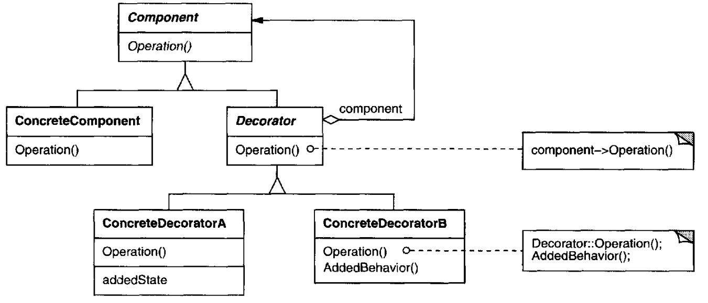
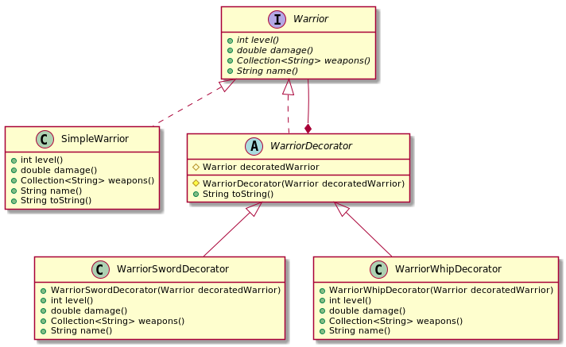

# Decorator

## Intent

Attach additional responsibilities to an object dynamically. Decorators provide a flexible alternative to subclassing for extending functionality.

## Also Known As

Wrapper

## Applicability

* to add responsibilities to individual objects dynamically and transparently, that is, without affecting other objects
* for responsibilities that can be withdrawn
* when extension by subclassing is impractical. Sometimes a large number of independent extensions are possible and would produce an explosion of subclasses to support every combination. Or a class definition maybe hidden or otherwise unavailable for subclassing

## Structure



## Participants

* **`Component`**: defines the interface for objects that can have responsibilities added to them dynamically
* **`ConcreteComponent`**: defines an object to which additional responsibilities can be attached
* **`Decorator`**: maintains a reference to a Component object and defines an interface that conforms to Component's interface
* **`ConcreteDecorator`**: adds responsibilities to the component

## Collaborations

Decorator forwards requests to its Component object. It may optionally perform additional operations before and after forwarding the request.

## Consequences

### Adventages

* More flexibility than static inheritance
* Avoids feature-laden classes high up in the hierarchy

### Disadvantages

* A decorator and its component aren't identical
* Lots of little objects

## Related Patterns

*Adapter*: A *decorator* is different from an adapter in that a decorator only changes an object's responsibilities, not its interface; an adapter will give an object a completely new interface.

*Composite*: A *decorator* can be viewed as a degenerate composite with only one component. However, a decorator adds additional responsibilities—it isn't intended for object aggregation.

*Strategy*: A *decorator* lets you change the skin of an object; a strategy lets you change the guts. These are two alternative ways of changing an object.

## Example in Java



```java
interface Warrior {
    int level();
    double damage();
    Collection<String> weapons();
    String name();
}

class SimpleWarrior implements Warrior {
    @Override
    public int level() {
        return 1;
    }

    @Override
    public double damage() {
        return 10;
    }

    @Override
    public Collection<String> weapons() {
        return Collections.singletonList("Fists");
    }

    @Override
    public String name() {
        return "Simple Warrior";
    }

    @Override
    public String toString() {
        return name() + " level " + level() + " Damage: " + damage() + " Weapons: " + String.join(",", weapons());
    }
}

abstract class WarriorDecorator implements Warrior {
    protected final Warrior decoratedWarrior;

    protected WarriorDecorator(Warrior decoratedWarrior) {
        this.decoratedWarrior = decoratedWarrior;
    }

    @Override
    public String toString() {
        return name() +  " level " + level() + " Damage: " + damage() + " Weapons: " + String.join(",", weapons());
    }
}

class WarriorSwordDecorator extends WarriorDecorator {
    public WarriorSwordDecorator(Warrior decoratedWarrior) {
        super(decoratedWarrior);
    }

    @Override
    public int level() {
        return decoratedWarrior.level() + 1;
    }

    @Override
    public double damage() {
        return decoratedWarrior.damage() + 15;
    }

    @Override
    public Collection<String> weapons() {
        Collection<String> weapons = new ArrayList<>();
        weapons.add("Sword");
        weapons.addAll(decoratedWarrior.weapons());
        return weapons;
    }

    @Override
    public String name() {
        return "Sword Warrior";
    }
}

class WarriorWhipDecorator extends WarriorDecorator {
    public WarriorWhipDecorator(Warrior decoratedWarrior) {
        super(decoratedWarrior);
    }

    @Override
    public int level() {
        return decoratedWarrior.level() + 1;
    }

    @Override
    public double damage() {
        return decoratedWarrior.damage() + 12;
    }

    @Override
    public Collection<String> weapons() {
        Collection<String> weapons = new ArrayList<>();
        weapons.add("Whip");
        weapons.addAll(decoratedWarrior.weapons());
        return weapons;
    }

    @Override
    public String name() {
        return "Whip Warrior";
    }
}

// --

public final class Arena {
    public static void main(String[] args) {
        // sample code for using warriors
        Warrior simpleWarrior = new SimpleWarrior();
        System.out.println(simpleWarrior);  // Simple Warrior level 1 Damage: 10.0 Weapons: Fists

        Warrior swordWarrior = new WarriorSwordDecorator(simpleWarrior);
        System.out.println(swordWarrior);   // Sword Warrior level 2 Damage: 25.0 Weapons: Sword,Fists

        Warrior whipWarrior = new WarriorWhipDecorator(swordWarrior);
        System.out.println(whipWarrior);    // Whip Warrior level 3 Damage: 37.0 Weapons: Whip,Sword,Fists
    }
}
```
