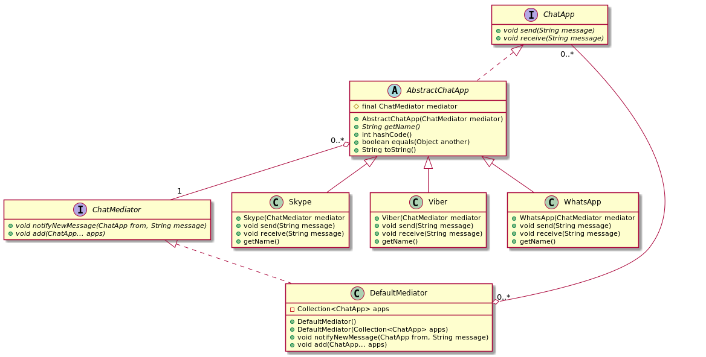

# Mediator

## Intent

Define an object that encapsulates how a set of objects interact. Mediator promotes loose coupling by keeping objects from referring to each other explicitly, and it lets you vary their interaction independently.

## Applicability

* a set of objects communicate in well-defined but complex ways. The resulting interdependencies are unstructured and difficult to understand.
* reusing an object is difficult because it refers to and communicates with many other objects.
* a behavior that's distributed between several classes should be customizable without a lot of subclassing.

## Structure


## Participants

* **`Mediator`**: defines an interface for communicating with `Colleague` objects
* **`ConcreteMediator`**:
  - implements cooperative behavior by coordinating Colleague objects
  - knows and maintains its colleagues
* **`Colleague` classes**:
  - each `Colleague` class knows its `Mediator` object
  - each colleague communicates with its mediator whenever it would have otherwise communicated with another colleague

## Collaborations

`Colleague`s send and receive requests from a `Mediator` object. The mediator implements the cooperative behavior by routing requests between the appropriate colleague(s).

## Consequences

* It limits subclassing
* It decouples colleagues
* It simplifies object protocols
* It abstracts how objects cooperate
* It centralizes control

## Related Patterns

*Facade* differs from *Mediator* in that it abstracts a subsystem of objects to provide a more convenient interface. Its protocol is unidirectional; that is, *Facade* objects make requests of the subsystem classes but not vice versa. In contrast, *Mediator* enables cooperative behavior that colleague objects don't or can't provide, and the protocol is multidirectional.

Colleagues can communicate with the mediator using the *Observer* pattern.

## Example in Java



```java
public interface ChatApp {
    void send(String message);
    void receive(String message);
}

public abstract class AbstractChatApp implements ChatApp {
    protected final ChatMediator mediator;

    public AbstractChatApp(ChatMediator mediator) {
        this.mediator = mediator;
    }

    abstract String getName();

    @Override
    public int hashCode() {
        return Objects.hashCode(getName());
    }

    @Override
    public boolean equals(Object another) {
        if (this == another) return true;
        if (another instanceof AbstractChatApp) return getName().equals(((AbstractChatApp) another).getName());
        return false;
    }

    @Override
    public String toString() {
        return getName();
    }
}

public interface ChatMediator {
    void notifyNewMessage(ChatApp from, String message);
    void add(ChatApp... apps);
}

public class DefaultMediator implements ChatMediator {
    private final Collection<ChatApp> apps;

    public DefaultMediator() {
        apps = new ArrayList<>();
    }

    public DefaultMediator(Collection<ChatApp> apps) {
        this.apps = new ArrayList<>(apps);
    }

    @Override
    public void notifyNewMessage(ChatApp from, String message) {
        apps
                .stream()
                .filter(app -> !app.equals(from))
                .forEach(app -> app.receive("From " + from + " -> " + message));
    }

    @Override
    public void add(ChatApp... apps) {
        this.apps.addAll(Arrays.asList(apps));
    }
}

public class Skype extends AbstractChatApp {
    public Skype(ChatMediator mediator) {
        super(mediator);
    }

    @Override
    public void send(String message) {
        mediator.notifyNewMessage(this, message);
    }

    @Override
    public void receive(String message) {
        System.out.println("[" + getName() + "] [" + Instant.now() + "]: " + message);
    }

    @Override
    String getName() {
        return "Skype";
    }
}

public class Viber extends AbstractChatApp {
    public Viber(ChatMediator mediator) {
        super(mediator);
    }

    @Override
    public void send(String message) {
        mediator.notifyNewMessage(this, message);
    }

    @Override
    public void receive(String message) {
        System.out.println("On " + getName() + ": " + message);
    }

    @Override
    String getName() {
        return "Viber";
    }
}

public class WhatsApp extends AbstractChatApp {
    public WhatsApp(ChatMediator mediator) {
       super(mediator);
    }

    @Override
    public void send(String message) {
        mediator.notifyNewMessage(this, message);
    }

    @Override
    public void receive(String message) {
        System.out.println("<<" + getName() + ">> " + message);
    }

    @Override
    String getName() {
        return "WhatsApp";
    }
}

// --

public final class Platform {
    public static void main(String[] args) {
        ChatMediator mediator = new DefaultMediator();

        ChatApp skype = new Skype(mediator);
        ChatApp whatsApp = new WhatsApp(mediator);
        ChatApp viber = new Viber(mediator);

        mediator.add(skype, whatsApp, viber);

        skype.send("Hi, I'm John");                 // <<WhatsApp>> From Skype -> Hi, I'm John
                                                    // On Viber: From Skype -> Hi, I'm John

        viber.send("Hi, John. How are you?");       // [Skype] [2020-06-25T13:02:50.072169Z]: From Viber -> Hi, John. How are you?
                                                    // <<WhatsApp>> From Viber -> Hi, John. How are you?

        whatsApp.send("Hi, John. Welcome!");        // [Skype] [2020-06-25T13:00:38.013434Z]: From WhatsApp -> Hi, John. Welcome!
                                                    // On Viber: From WhatsApp -> Hi, John. Welcome!
    }
}
```
