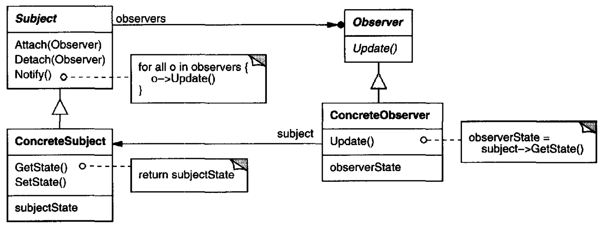
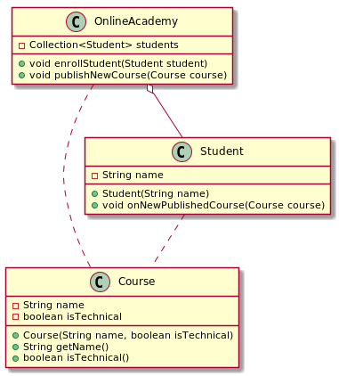

# Observer

## Intent

Define a one-to-many dependency between objects so that when one object changes state, all its dependents are notified and updated automatically.

## Also Known As

Dependents, Publish-Subscribe

## Applicability

* When an abstraction has two aspects, one dependent on the other. Encapsulating these aspects in separate objects lets you vary and reuse them inde pendently.
* When a change to one object requires changing others, and you don't know how many objects need to be changed.
* When an object should be able to notify other objects without making assumptions about who these objects are. In other words, you don't want these objects tightly coupled.

## Structure



## Participants

* **`Subject`**
  - knows its observers. Any number of `Observer` objects may observe a subject.
  - provides an interface for attaching and detaching `Observer` objects.
* **`Observer`**: defines an updating interface for objects that should be notified of changes in a subject.
* **`ConcreteSubject`**
  - stores state of interest to `ConcreteObserver` objects.
  - sends a notification to its observers when its state changes.
* **`ConcreteObserver`**
  - maintains a reference to a `ConcreteSubject` object.
  - stores state that should stay consistent with the subject's.
  - implements the `Observer` updating interface to keep its state consistent with the subject's.

## Collaborations

* `ConcreteSubject` notifies its observers whenever a change occurs that could make its observers' state inconsistent with its own.
* After being informed of a change in the concrete subject, a `ConcreteObserver` object may query the subject for information. `ConcreteObserver` uses this information to reconcile its state with that of the subject.

## Consequences

* The Observer pattern lets you vary subjects and observers independently
* You can reuse subjects without reusing their observers, and vice versa
* It lets you add observers without modifying the subject or other observers
* Abstract coupling between `Subject` and `Observer`
* Support for broadcast communication
* Unexpected updates

## Example in Java



```java
public class Course {
    private final String name;
    private final boolean isTechnical;

    public Course(String name, boolean isTechnical) {
        this.name = name;
        this.isTechnical = isTechnical;
    }

    public boolean isTechnical() {
        return isTechnical;
    }

    public String getName() {
        return name;
    }

    @Override
    public boolean equals(Object o) {
        if (this == o) return true;
        if (o == null || getClass() != o.getClass()) return false;
        Course course = (Course) o;
        return isTechnical == course.isTechnical() && name.equals(course.getName());
    }

    @Override
    public int hashCode() {
        return Objects.hash(name, isTechnical);
    }

    @Override
    public String toString() {
        return "Course{name='" + name + "'" + ", isTechnical=" + isTechnical + "}";
    }
}

public class Student {
    private final String name;

    public Student(String name) {
        this.name = name;
    }

    public void onNewPublishedCourse(Course course) {
        System.out.println(this + " enrolled in " + course);
    }

    @Override
    public String toString() {
        return "Student{name='" + name + "'}";
    }
}

public class OnlineAcademy {
    Collection<Student> students = new ArrayList<>();

    public void enrollStudent(Student student) {
        students.add(student);
    }

    public void publishNewCourse(Course course) {
        students.forEach(student -> student.onNewPublishedCourse(course));
    }
}

// --

public final class Runner {
    public static void main(String[] args) {
        Student john = new Student("John");
        Student ana = new Student("Ana");

        OnlineAcademy academy = new OnlineAcademy();
        academy.enrollStudent(john);
        academy.enrollStudent(ana);

        academy.publishNewCourse(new Course("Design patterns", true));  // Student{name='John'} enrolled in Course{name='Design patterns', isTechnical=true}
                                                                        // Student{name='Ana'} enrolled in Course{name='Design patterns', isTechnical=true}
        academy.publishNewCourse(new Course("Philosophy", false));      // Student{name='John'} enrolled in Course{name='Philosophy', isTechnical=false}
                                                                        // Student{name='Ana'} enrolled in Course{name='Philosophy', isTechnical=false}
    }
}
```
