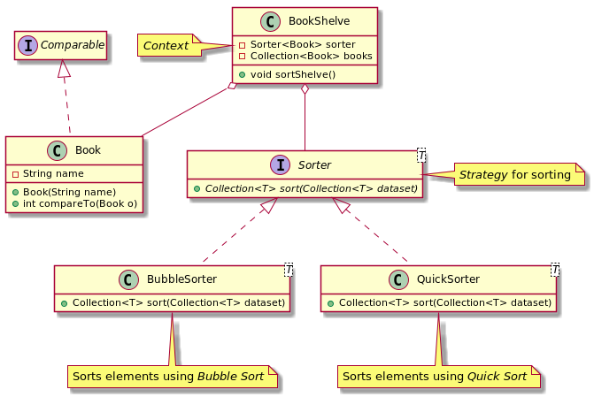

# Strategy

## Intent

Define a family of algorithms, encapsulate each one, and make them interchangeable. Strategy lets the algorithm vary independently from clients that use it.

## Also Known As

Policy

## Applicability

* many related classes differ only in their behavior. Strategies provide a way to configure a class with one of many behaviors.
* you need different variants of an algorithm.
* an algorithm uses data that clients shouldn't know about. Use the Strategy pattern to avoid exposing complex, algorithm-specific data structures.
* a class defines many behaviors, and these appear as multiple conditional statements in its operations. Instead of many conditionals, move related conditional branches into their own Strategy class.

## Structure


## Participants

* **`Strategy`**: declares an interface common to all supported algorithms. `Context` uses this interface to call the algorithm defined by a `ConcreteStrategy`.
* **`ConcreteStrategy`**: implements the algorithm using the `Strategy` interface.
* **`Context`**
  - is configured with a `ConcreteStrategy` object.
  - maintains a reference to a `Strategy` object.
  - may define an interface that lets `Strategy` access its data.

## Collaborations

* `Strategy` and `Context` interact to implement the chosen algorithm. A context may pass all data required by the algorithm to the strategy when the algorithm is called. Alternatively, the context can pass itself as an argument to `Strategy` operations. That lets the strategy call back on the context as required.
* A context forwards requests from its clients to its strategy. `Clients` usually create and pass a `ConcreteStrategy` object to the context; thereafter, clients interact with the context exclusively. There is often a family of `ConcreteStrategy` classes for a client to choose from.

## Consequences

* Families of related algorithms
* An alternative to subclassing
* Strategies eliminate conditional statements
* A choice of implementations
* Clients must be aware of different *Strategies*
* Communication overhead between `Strategy` and `Context`
* Increased number of objects

## Related Patterns

*Strategy* objects often make good *Flyweight*s.

## Example in Java



```java
public interface Sorter<T> {
    Collection<T> sort(Collection<T> dataset);
}

public class BubbleSorter<T> implements Sorter<T> {
    @Override
    public Collection<T> sort(Collection<T> dataset) {
        Collection<T> sortedDataset = dataset; // TODO: implement sorting
        return sortedDataset;
    }
}

public class QuickSorter<T> implements Sorter<T> {
    @Override
    public Collection<T> sort(Collection<T> dataset) {
        Collection<T> sortedDataset = dataset; // TODO: implement sorting
        return sortedDataset;
    }
}

public class Book implements Comparable<Book> {
    private final String name;

    public Book(String name) {
        this.name = name;
    }

    @Override
    public int compareTo(Book o) {
        return name.compareTo(o.name);
    }
}

public class BookShelve {
    private Sorter<Book> sorter = new BubbleSorter<>();  // at run-time, the strategy can be change as needed by setting a new sorter from the ones available
    private Collection<Book> books = new ArrayList<>();

    private void sortShelve() {
        books = sorter.sort(books);   // sorting using the defined strategy
    }
}
```
