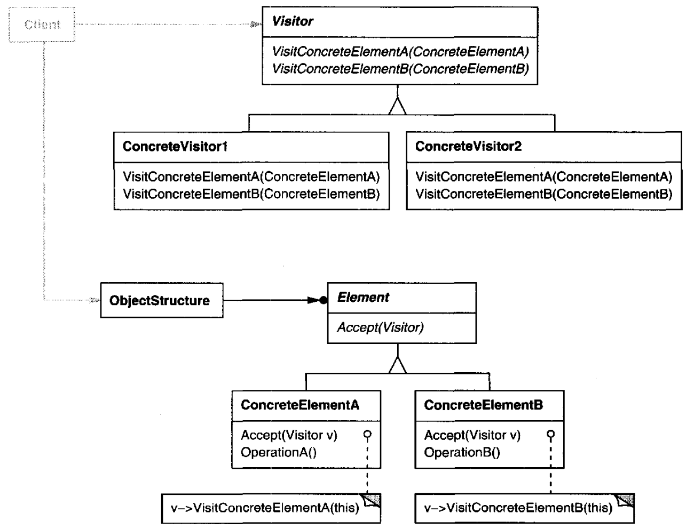
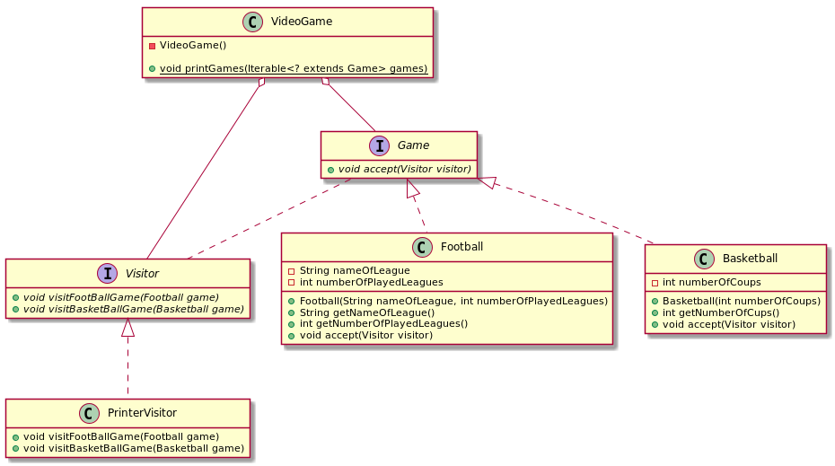

# Visitor

## Intent

Represent an operation to be performed on the elements of an object structure. *Visitor* lets you define a new operation without changing the classes of the elements on which it operates.

## Applicability

* an object structure contains many classes of objects with differing interfaces, and you want to perform operations on these objects that depend on their concrete classes.
* many distinct and unrelated operations need to be performed on objects in an object structure, and you want to avoid "polluting" their classes with these operations. Visitor lets you keep related operations together by defining them in one class. When the object structure is shared by many applications, use *Visitor* to put operations in just those applications that need them.
* the classes defining the object structure rarely change, but you often want to define new operations over the structure. Changing the object structure classes requires redefining the interface to all visitors, which is potentially costly. If the object structure classes change often, then it's probably better to define the operations in those classes.

## Structure



## Participants

* **`Visitor`**
  - declares a `visit` operation for each class of `ConcreteElement` in the object structure. The operation's name and signature identifies the class that sends the `visit` request to the visitor. That lets the visitor determine the concrete class of the element being visited. Then the visitor can access the element directly through its particular interface.
* **`ConcreteVisitor`**
  - implements each operation declared by `Visitor`. Each operation implements a fragment of the algorithm defined for the corresponding class of object in the structure. `ConcreteVisitor` provides the context for the algorithm and stores its local state. This state often accumulates results during the traversal of the structure.
* **`Element`**
  - defines an `accept` operation that takes a visitor as an argument.
* **`ConcreteElement`**
  - implements an `accept` operation that takes a visitor as an argument.
* **`ObjectStructure`**
  - can enumerate its elements.
  - may provide a high-level interface to allow the visitor to visit its elements.
  - may either be a *composite* or a collection such as a list or a set.

## Collaborations

* A client that uses the *Visitor* pattern must create a `ConcreteVisitor` object and then traverse the object structure, visiting each element with the visitor.
* When an element is visited, it calls the Visitor operation that corresponds to its class. The element supplies itself as an argument to this operation to let the visitor access its state, if necessary.

## Consequences

* *Visitor* makes adding new operations easy
* A visitor gathers related operations and separates unrelated ones
* Adding new ConcreteElement classes is hard
* Visiting across class hierarchies
* Accumulating state
* Breaking encapsulation

## Related Patterns

*Visitor*s can be used to apply an operation over an object structure defined by the *Composite* pattern.

*Visitor* may be applied to do the interpretation (*Interpreter*).

## Example in Java



```java
public interface Visitor {
    void visitFootBallGame(Football game);
    void visitBasketBallGame(Basketball game);
}

public final class PrinterVisitor implements Visitor {

    @Override
    public void visitFootBallGame(Football game) {
        print(String.format("%s: %d", game.getNameOfLeague(), game.getNumberOfPlayedLeagues()));
    }

    @Override
    public void visitBasketBallGame(Basketball game) {
        print(String.format("Cups: %s", game.getNumberOfCups()));
    }

    private void print(String string) { System.out.println(string); }
}

public interface Game {
    void accept(Visitor visitor);
}

public class Football implements Game {
    private final String nameOfLeague;
    private final int numberOfPlayedLeagues;

    public Football(String nameOfLeague, int numberOfPlayedLeagues) {
        this.nameOfLeague = nameOfLeague;
        this.numberOfPlayedLeagues = numberOfPlayedLeagues;
    }

    public String getNameOfLeague() { return nameOfLeague; }

    public int getNumberOfPlayedLeagues() { return numberOfPlayedLeagues; }

    @Override
    public void accept(Visitor visitor) { visitor.visitFootBallGame(this); }
}

public class Basketball implements Game {
    private final int numberOfCoups;

    public Basketball(int numberOfCoups) { this.numberOfCoups = numberOfCoups; }

    public int getNumberOfCups() { return numberOfCoups; }

    @Override
    public void accept(Visitor visitor) { visitor.visitBasketBallGame(this); }
}

public final class VideoGame {
    private VideoGame() {}

    public static void printGames(Iterable<? extends Game> games) {
        Visitor visitor = new PrinterVisitor();
        games.forEach(game -> game.accept(visitor));
    }
}
```
