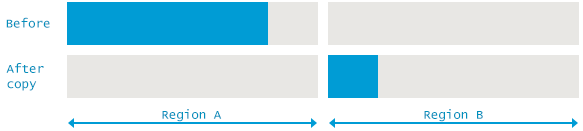

# MARK-and-SWEEP
1. Marks live objects 
2. removes unreachable objects (every object that is considered dead and unused)

## Marking Live Objects

### GC ROOTS
- special objects, local variable and input parameters of currently executing methods, active threads
static fields of loaded classes and JNI references. 
- GC traverses entire object graph memory
    - starts from GC roots and follows refs from roots to other object
    - every object visited by GC is marked as "ALIVE"
    
### STOP THE WORLD PAUSE
- app threads have to be stopped for marking to happen
    - traversal doesn't work if obj. graph keeps changing
    
## REMOVAL METHODS
### NORMAL DELETION (Mark-Sweep)

- removes unref'd objects to free space
- leaves ref'd objects and pointers
- memory allocated holds refs to blocks of free space where new obj. can be allocated

### COMPACTED DELETION (mark-sweep-compact)

- only removing unused obj (i.e. mark-sweep) isn't efficient, because blocks of free mem
are scattered around storage area
    - large objects might not find a large enough contiguous block, so it leads to
    OutOfMemoryError (even though there is plenty of memory)
- the above problem is solved w/ mark-sweep-compact
    - after removing unref'd objects, the remaining ref'd objects are compacted,
    making further allocations faster/easier
        
### DELETION WITH COPY (mark-copy)

- similar to mark-sweep-compact, but the difference is that the target of relocation is a 
different memory region. 