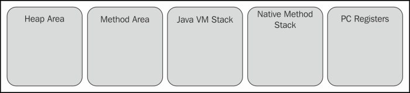

# JVM Memory Model 

## Model/Structure
JVM defines RUN-TIME data areas used during the execution of a program. 

### HEAP AREA
Runtime data area
- memory is allocated for all class instances and arrays
- created during JVM startup
- can be FIXED or DYNAMIC size
    - based on system configuration
- memory does NOT have to be contiguous
- reclaimed by automatic storage management system (GC!) 
- OOM Error can be thrown if a computation requests more heap that can be made available by the
GC system. 

### Method Area + Runtime Constant Pool
Method area stores Per-Class Structures such as
- Runtime Constant Pool
- Field and Method Data
- Code for Methods and Constructors
    - includes special methods used in class, instance and interface init.

Creation/Features
- created on JVM startup
- part of heap that can NOT be GC'd
- may be of FIXED size or EXPANDED/CONTRACTED if size is necessary/unnecessary
- does NOT have to be contiguous
- OOM Error can be thrown if a computation requests more heap that can be made available by the
GC system. 

### JVM Stacks
Private stack of storage allocated per thread that is created at the time the thread is created. 
- stores FRAMES

FRAME
- stores data (usually local vars), partial results
- performs dynamic linking
- return values for methods
- dispatches exceptions

FEATURES
- never manipulated directly (other than to push/pop frames), it MAY be GC'd.
- doesn't need to be contiguous
- may be FIXED or DYNAMIC
    - each stack can have it size independently of the JVM stacks of other threads.
- throws OOM error if expansion is attempted, but resources aren't available. 
- if a COMPUTATION requires a larger stack than is permitted, a StackOverflowError is thrown.

### Native Method Stacks (aka C Stacks)
Supports native methods (i.e. methods written in a language other than Java)
- typically allocated per each thread when that thread is created. 
- NOTE: JVM impls that can't load naive methods (or don't rely on conventional stacks) don't
support Native Method Stacks. 
- may be fixed or dynamic in size. 
- if computation requires a larger stack than is permitted, a StackOverflow is thrown. 
- If an expansion is attempted, but there aren't enough resources to expand , then OOM is thrown.

### PC Registers
Each JVM Thread has its own PC (program counter) register. 
- At any given moment in time, each JVM thread is running code of a SINGLE method. 

NATIVE METHODS
- JVM PC register is UNDEFINED

NON-NATIVE METHODS (i.e. JAVA CODE)
- PC register contains address of JVM instruction currently being exec'd