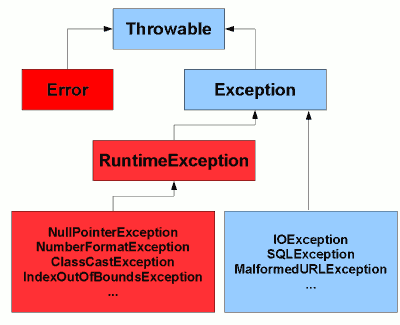

# Exception
- an unexpected event that occurs during the execution of a program that disrupts the normal flow of 
instructions
- in Java, all errors/exceptions represented w/ Throwable class. 

## Throwing An Exception
- when error occurs, the method created an "exception" object (of Throwable or subtype) and hands it 
down to runtime system. 

## Exception Handling
1. handle it locally in the method at which it occurs
1. pass it to the caller method, letting it handle it.

Exception Ownership should be handled carefully
- methods should CLEARLY indicate (using Throws) the exceptions it will handle.

Exception handling is performed in the Try/Catch block
- TRY to execute code that can fail
- CATCH the exception when it does.

## Checked Exceptions
subclasses of Exception class
- These MUST be handled in some manner in our application code
- These are CHECKED by the compiler (hence the term)
- Generally speaking, these denote situations that our outside the immediate control of the
program
    - external resources (network, database, filesystem)
    
## Unchecked Exceptions
Subclasses of RuntimeException
- These are NOT checked by the compiler (hence the term!)
- a method isn't forced by the compiler to declare unchecked exceptions

A funny contradiction. RuntimeException is a subclass of Exception, so it should be 
implicitly a checked exception.. but they aren't. Good job Java. 

## Exception Handling Best Practices
- CHECKED exceptions can be used when a method cannot do what its NAME SAYS IT DOES
    - i.e. if a method is doThing, then exceptions should be thrown/declared for the 
    circumstances where the method can't do the thing. 
- CHECKED exceptions should never be used for programming errors
- CHECKED exceptions should be used for RESOURCE ERRORS and FLOW CONTROL related to resource errors
- Methods should make attempts to handle it as soon as it occurs
    - throw ony those exceptions that the method is unable to handle by any means
- declare exceptions w/ similar names as the method
    - i.e. openFile throws FileNotFoundException
    - i.e. findProvider throws NoSuchProviderException
    - these types of exceptions should be into checked exceptions.
    
## RULE OF CHECKED VS UNCHECKED
CHECKED
- exceptions where a client can be reasonably expected to recover from an exception
- this means that the task may or may not be completed, retried etc. 

UNCHECKED
- exceptions where a client can't do anything whatsoever to recover from the exception.
- the task fails, but we are responsible for ensuring that this doesn't cause the application
to fail in a fatal manner. 

