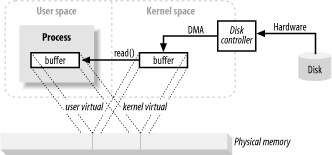

# Java IO Internals

## Buffer Handling and Kernel vs. User Space
I/O is more or less just moving data in and out of buffers. 
- WRITE OPERATION = draining data from a buffer
- READ OPERATION = filling buffer with data

### How a Block of Data moves
- process makes a read() call
    - causes kernel to issue a command to a disk controller HW
    to fetch data from disk
    - disk controller writes data directly into a kernel memory 
    buffer (using DMA)
    - once buffer is filled, kernel copies data from temp buffer in
    kernel space to a persistent buffer owned by the process that
    made the read() call. 
    
kernel tries to CACHE (and/or prefetch) data so that the data being 
requested by the process may already be available in the kernel 
space. 

## Virtual Memory

- artificial/virtual addresses used in place of physical (RAM) memory
addresses. 

### ADVANTAGES
- more than 1 Virtual Addy can refer to the same physical memory location
- virtual memory space can be larger than the actual hardware memory available

### ADVANTAGE 1 IN EFFECT
mapping kernel space addy to same physical addy as a virtual address in use space
allows for a buffer that is visible to both the kernel and a user space
process.
- this eliminates copies between kernel and user space
- BUT requires kernel + user buffers to share same page alignment.
- buffers must be a multiple of the block size used by the disk 
controller
    - often 512 byte sectors
- MOST OS' divide memory address spaces into pages which are fixed-size
groups of bytes. 
- pages are always multiples of disk block size
    - usually powers of 2 (simplifies addressing)
    - 1024, 2048, 4096 bytes are common
- virtual + physical memory page sizes are always the same.

## MEMORY PAGING
(aka swapping)
pages of virtual mem space can be persisted to external disk in order to
make room in physical mem for other virtual pages. 
- PHYS MEM acts as a cache for a paging area 
    - paging area is space on disk where the content of mem pages is
    stored when forced out of PHYS mem
- ALIGNMENT of mem page sizes as multiples of DISK BLK SIZE allows
kernel to issue direct commands to DISK CONTROLLER HW to write mem
pages to disk/reload them when needed. 

- ALL DISK I/O is DONE AT PAGE LEVEL
    - this is the ONLY WAY data ever moves between disk and physical 
    memory in modern paged Operating Systems.
    
### MMU (Memory Management Unit)
- device/component that is between CPU and PHYS MEM.
- persists mapping information used to translate virtual mem addresses
to PHYS MEM addresses.
    - CPU references mem location
    - MMU determines the page that contains the location
        - (bit shift/masking bits of address value)
    - translates virt page no. to phys page no.
    
## FILE/BLOCK Oriented I/O
- always occurs in context of file system. 

### FILE SYSTEM VS DISK
- disks store data in sectors 
    - (usually in 512 byte sectors)
    - provide "slots" where data can be stored
    - sectors are all of uniform size and addressable as a large array
- filesystem is a higher level of abstraction
    - arranges/interprets data stored on disk (or some other random-
    access, block-oriented device)
    - organizes a sequences of uniformly sized data blocks
        - meta information:
            - maps of free blocks, directories, indexes etc.
            - info about individual files that describes
                - which blocks contain file data
                - where data ends
                - last update/access time
        - actual file data
    - user processes issue request to FILESYSTEM, whose impl 
    determines the details concerning how the data is located and
    read into memory 
    - filesystems also have pages. 
        - usually same size as mem page (or a multiple)
        - 2k - 8k bytes
        
        
### FILESYSTEM I/O STEPS
- user process requests data on disk. 
    - FS determines which pages are spanned by the request. 
        - (NOTE: data may be spread across multiple pages which
            may or may not be contiguous)
    - allocates enough memory pages in kernel to hold ID'd 
    filesystem pages
    - establishes mapping between memory pages and FS pages on disk
    - generates a PAGE FAULT for each of those memory pages
    - virt mem system TRAPS page faults
    - then schedules pageins to validate the pages by reading
        contents from disk
    - once pageins are done, FS breaks down raw data to extract 
    requested file content/attribute information
    
- NOTE: FS data is usually cached like other memory pages, so 
subsequent I/O requests may result in some/all of the requested day
being reused from PHYS MEM

## FILE LOCKING
scheme by which one process can prevent others from accessing a file or
restrict how other processes access that file. 
- file locking MAY be done at the file level    
- FILE REGION LOCKING is when a region of a file is locked (sometimes
with granularity at the byte level)
    - this allows coordination of specific areas of a file w/o impeding
    processes working elsewhere in the file. 
    - this is how collaboration within a file can occur. 
    
SHARED LOCKS
- multiple shared locks may be in effect for the same file region at 
the same time

EXCLUSIVE LOCKS
- require that no other locks can be in effect for the requested region.

## STREAM I/O
- modeled on a pipeline
- bytes are accessed sequentially
- examples
    - TTY (console) devices
    - printer ports
    - network connections
- usually slower than block devices
- NON-BLOCKING MODE
    - (supported by most OS)
    - permits a process to check if input is available on the stream
    w/o getting stuck if there isn't anything available. 
    - this allows a process to handle input as it arrives, but
    perform other tasks while input stream is idle.
       
READINESS SELECTION
- usually built on top of non-blocking mode.
- offloads the checking of whether or not the stream is ready to the OS
    - OS is usually told to watch a collection of streams
    - then returns an indication to the process of which streams
    are ready (the readiness information)
    - permits the multiplexing of many active streams w/ common code
    and a single thread. 
- USE CASE
    - widely used in network servers
    - "essential for high-volume scaling"
