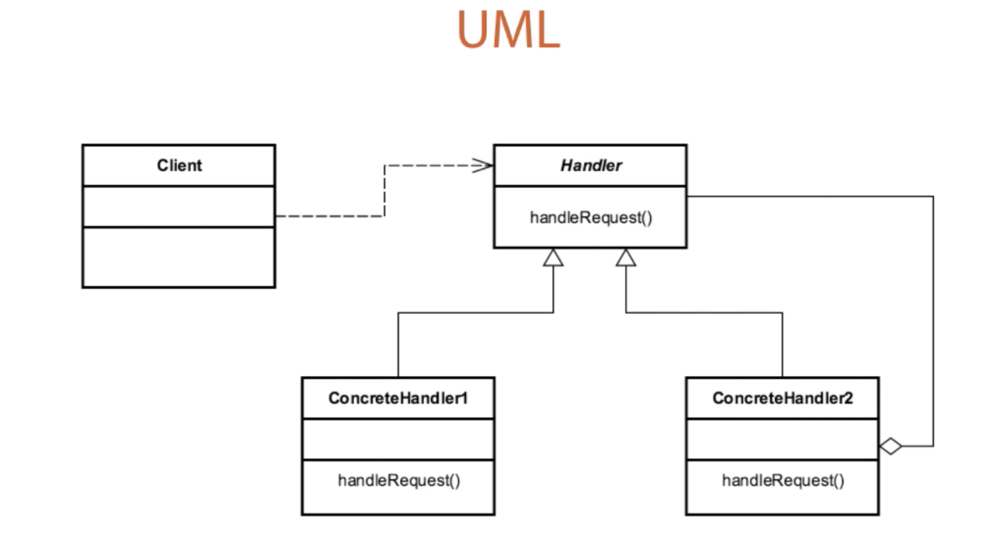

# Chain of Responsibility 

## Introduction
Decouples a request from a handling object in a chain of handlers until it 
is finally recognized

## Concepts
- decoupling SENDER and RECEIVER objects
- RECEIVER needs a reference to next receiver (aka successor)
    - doesn't know hierarchy, but knows next in line
- promotes loose coupling
- No Handler is OK
    - app just keeps goingi
    
EXAMPLES:
- java.util.logging.Logger#log()
- java.servlet.Filter#doFilter()
- Spring Security Filter Chain
    

## Design Considerations

- Chain of Receiver objects
    - usually implemented as a List
- Handler is Interface based
    - defines contract between each chain link
- ConcreteHandler for each implementation/receiver that will impl request
- each Handler has a reference to next link in chain (SUCCESSOR)

CLIENT
- makes calls to Handler class

HANDLER
- common interface/abstraction for all links/receivers/implementations in the chain

CONCRETE HANDLER
- each one is a link in the chain that passes request to SUCCESSOR when it can't
process the request it has been given.

SUCCESSOR (next handler in the chain)
- this is key, because the handlers only know about their successor. 
- they don't know about other commands. 

## Pitfalls
- Handling/Handler guarantee
    - there is no guarantee that your request will be handled
- Runtime configuration risk
    - there will be SOME configurations that don't get tested
- chain length can lead to performance issues
    - long long long chains. 

## Contrast to Other Patterns

| CHAIN OF RESPONSIBILITY | COMMAND |
| --- | --- |
| Handlers are unique | commands are also unique | 
| Successor | Encapsulates ALL functionality (no handoff)  | 
| can utilize Command pattern | Reversible/Trackable in nature | 
| no guarantee that it request is processed | we call a command, expecting that it can process what we want|

## Summary
- decouples sender and receiver from requetws
    - sender doesn't care who fulfills request
    - receiver doesn't usually care who sent it
- Runtime configuration
    - more flexible 
- hierarchical in nature
    - builds as it goes down the chain
- careful w/ large chains
    - performance sync
    - confusing

