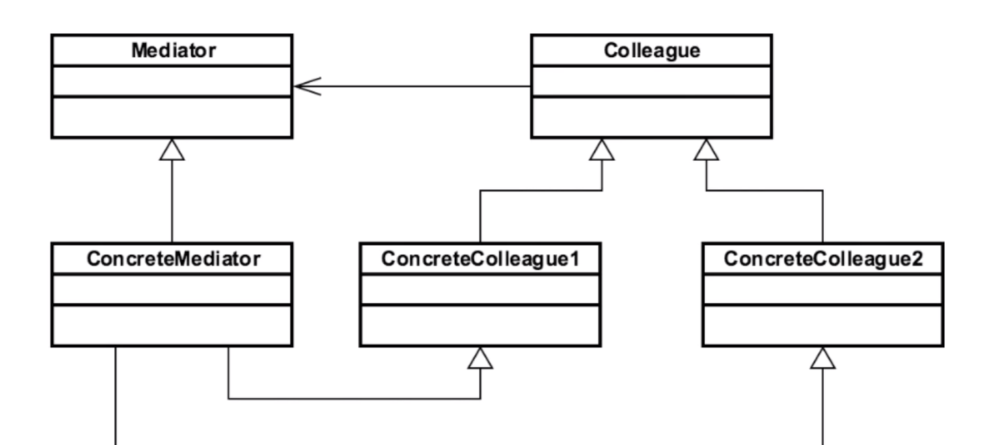

# MEDIATOR 

## Introduction
used to define how objects interact w/ each other w/o having
to refer to each other explicitly

## Concepts
- loose coupling
- well-defined objects w/ complex communication 
- reusable components
- "Hub/Router"
EXAMPLEs
- java.util.Timer
- java.lang.reflect.Method#invoke

## Design Considerations

- Interface based + Concrete Class
    - interface allows more flexibility
- minimizes inheritance (tighter coupling)
- knows about all colleagues rather than colleagues knowing about
each other

MEDIATOR
- interface/abstract class

CONCRETE MEDIATOR
- peer objects of MEDIATOR
- implements/extends from MEDIATOR
- communicate through mediator rather than to their PEERS

## Pitfalls
- don't create a Deity object
    - "everything to everyone"
    - becomes large and a single point of failure
- limits subclassing
- confusing/conflating with Command pattern

## Contrast to Other Patterns

| MEDIATOR | OBSERVER |
| --- | --- |
| Defines Interaction | 1:many "broadcast" to all listeners | 
| decouples objects from each other | object decoupling | 
| more specific | more generic | 

## Summary
- achieve loose coupling between objects by simplifying 
communication
- mediator complexity (deity object)
- often used w/ Command pattern. 
