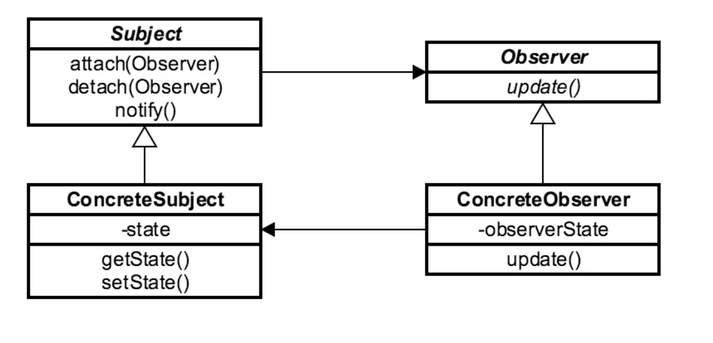

# Observer 

## Introduction
Decoupling pattern when we have a subject that needs to 
be observed by a variable number of listeners

## Concepts
- a subject has a 1->many relationship w/ observers
- decoupling pattern
- event handling 
- publish/subscriber
    - Observer is "typically" used synchronously
    - PubSub is usually async. 
    - I've found this to be a mixed bag. 
- used in MVC when View is event-driven

EXAMPLES:
    - java.util.Observer
    - java.util.EventListener
    - javax.jms.Topic

## Design Considerations

SUBJECT
- needs to be observer
- usually interface/ABC
    - has concrete implementations
- observers register themselves w/ subject

CONCRETE SUBJECT
- (if exists)
    - sometimes subject is just a single object
    - contains state that observers want to be notified about
    
OBSERVER
- interface based w/ various concrete impls
- Views in MVC are "Concrete Observers"
- has an update() method 
    - gets called when there is a state change in subject 
    resulting in a notification
 
CONCRETE OBSERVER
- impls of Observer interface
- act upon changes in subject

OBSERVABLE
- interface implemented by SUBJECT

## Pitfalls
- unexpected updates
    - subject doesnt  know about its observers
- large sized consequences
- not knowing what has changed due to decoupling of subject
- debugging difficult     

## Contrast to Other Patterns

| OBSERVER | MEDIATOR |
| --- | --- |
| one-to-many | one to one to many | 
| decouple object from observers | decoupling of complex communication | 
| pub sub communication | complex communication | 

common implementation
client -> Mediator -> broadcast through an observer.

## Summary
- decoupled communication
    - objects that we want to broadcast to 
- built-in functionality 
    - this is no longer true as Observer/Observable is deprecated
- often used w/ Mediator