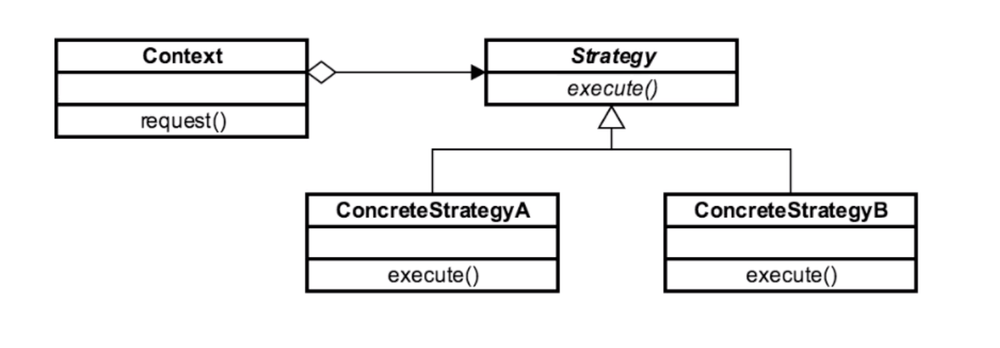

# Strategy 

## Introduction
used when you want to allow algorithm/strategy to be selected at runtime

## Concepts
- eliminate conditional statements in application
- encapsulates algo options in classes
- use it when it is hard to add new strategies
- client is aware of options/chooses strategy

EXAMPLES:
- java.util.Comparator

## Design Considerations

- interface/abstract base class based
- 1 Concrete class per strategy
- reduce/eliminate cyclomatic complexity (if/else)
- strategies are independent

CONTEXT
- receives requests
- dispatches request to which strategy should handle it based on the situation

STRATEGY
- defines method contracts for strategy handlers

CONCRETE STRATEGY
- 1 concrete class per algorithm that does the actual handling of the request.

## Pitfalls
- client must be aware of all of the concrete strategies
- increased number of classes
    - slight overhead
    - (worth it for simplicity of maint.)

## Contrast to Other Patterns

| STATE | STRATEGY |
| --- | --- |
| Interface based w/ a collection of concrete | Interface based  | 
| only knows about "next state" in can transition to | algorithms are independent from one another. (They don't know about the next state) |
| 1 class per state  | 1 class per algorithm | 

## Summary
- externalize algorithms inside of an app
- client knows about the different algorithms/strategies
- 1 class per strategy/algorithm
- reduces cyclomatic complexity (i.e. conditionals)
