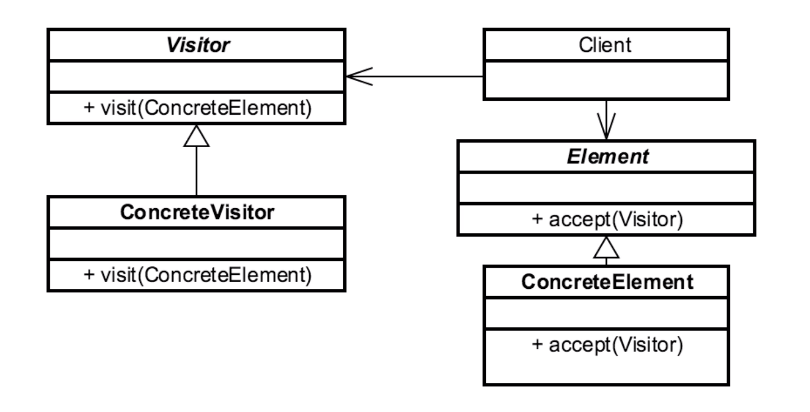

# VISITOR 

## Introduction
separates an algorithm from the object structure

## Concepts
- separate algorithm from object structure
    - expecting lots of change/churn/new features
        - we want to avoid (or can't) change the object structure
- maintain open/closed principle (closed for change/open for extension)

EXAMPLES:
- java.lang.model.element.Element
- java.lang.model.element.ElementVisitor

## Design Considerations

- Interface based design
- must design around the Visitor from the get go
    - hard to use as a refactoring pattern
- impl Visitor in each Element
    - each Element has a visit() method
    - the visitor knows about every element

CLIENT
- creates the elements

VISITOR
- has a visit() method that accepts a ConcreteElement
    - it will have one method for each ConcreteElement we want to interact with.

CONCRETE VISITOR
- 1 impl for each ConcreteElement
- changes take place here.

ELEMENT
- instances of element interface

CONCRETE ELEMENT
- instead of changing every time we want to add functionality, 
we use an accept() method that takes a Visitor as an argument.

## Pitfalls
- plan for adaptability
    - can lead to overarchitecture (i.e. flexibility isn't required/used)
- indirection somewhat confusing
- Adapter pattern might be better

## Contrast to Other Patterns

| VISITOR | ITERATOR |
| --- | --- |
| Interface Based | Interface based, but usually impl'd via anonymous inner class | 
| adaptability through externalized changes | encapsulates navigation (doesn't externalize)  | 
| supports multiple visitors | singular | 

## Summary
- expecting changes inside app, but we don't know what they are up front
- minor complexity
- use it when we want to externalize change
    - open/closed principle (i.e. we can't change the object structure, but the behavior has a lot of churn)
- GREAT way to add tests