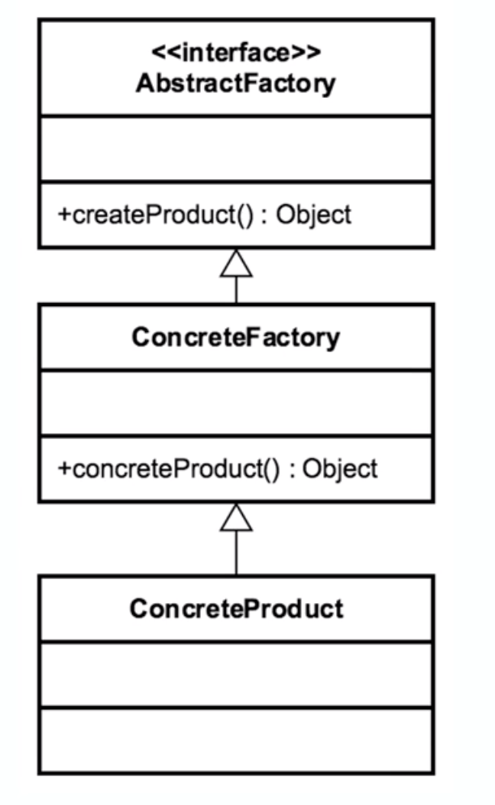

# Abstract Factory 

## Introduction 
Similar to Factory Method

## Concepts
- factory of factories
- can be implemented w/o factory method, but usually includes it
- factory of related objects
- common interface
- defers instantiation/creation logic to subclasses

EXAMPLES:
- DocumentBuilder
- (often implemented in Frameworks)

## Design Considerations

- group a collection of factories together
- factory responsible for lifecycle/creation
- Common Interface -> Concrete Factory -> Concrete Product
- ConcreteClasses returned by underlying Factory
- Parameterized create methods
- typically built using Composition

## Pitfalls
- complexity
    - most complex of the creational design patterns
    - difficult to implement
- "runtime switch"
    - users have a lot of control over what is accomplished at runtime.
- Pattern within a pattern
- very problem specific.
- starts off as a factory, and is refactored as an abstract factory.

## Contrast to Other Patterns
| FACTORY | ABSTRACT FACTORY |
| --- | --- | 
| Returns various instances   multiple constructors  | "usually " Implemented with a factory   hides factory| 
| interface driven | built through composition |
| easily adapts to environment | abstracts the environment | 

## Summary
- Group of similar factories
- very complex
- heavily abstracted
    - composition, interfaces, subclasses, abstract base classes
- typically a framework pattern.
