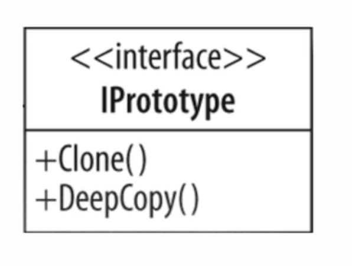

# Prototype

## Intro
Used when type of object is determined by a "prototypical"instance that is cloned. 
Used to create a unique instance of the same object  (focus on unique!) 

## Concepts
- economize the creation of objects
    - avoid COSTLY creation
- "usually" implemented as a refactoring
    - not typically used from the get go
- avoid subclassing
- typically avoid the keyword "new"
    - first instance uses new
    - subsequent objects are created as a clone
- implemented with an interface (usually)
- usually implemeneted with a Registry

EXAMPLES 
- java.lang.Object#clone()

## Design Considerations

- creative way to use the keyword "new"
    - avoids calling "new" by implementing clone/cloneable method and interface
- although a "copy", each instance unique
- costly construction not handled by client
    - which is what the builder does
    - "Prototype" is like the "opposite" of a Builder
- allows usage of params in constructor
    - unlike the Singleton
- flexibility in copy method
    - SHALLOW (copies primitives only)
    - DEEP (copies objects and traverses their attributes) 

## Pitfalls
- sometimes they just aren't clear when to use them
- typically have to be used other patterns. 
    - "loose" definition of a Framework is a pattern that uses other patterns.
    - VERY commonly used w/ a Registry
- shallow vs. deep copy
    - deep copy is more complex.

## Contrast to Other Patterns

| PROTOTYPE | FACTORY | 
| --- | --- |
| lighter weight construction   copy constructor/clone  | Flexible Objects   multiple constructors|
| shallow/deep copy | Concrete Instance | 
| "copy of itself" | Fresh Instance (no copy) | 

Typically a factory doesn't have defaults in the same manner that a Prototype does

## Summary
- guarantee a UNIQUE instance every time we ask. 
- often REFACTORED in
    - usually a performance optimization to reduce the creation of a large amount of
    similar objects. 
    - avoid overuse of keyword 'new'
- don't always jump to a Factory

