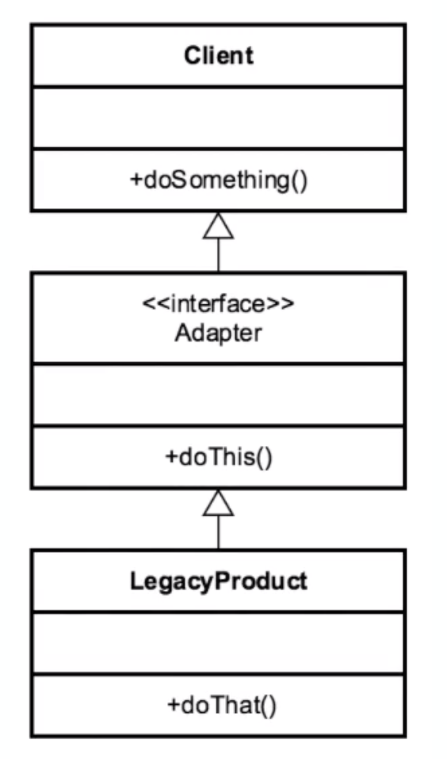

# Adapter

## Introduction
Connects new code w/ legacy code w/o breaking 
the contract produced from the original legacy code

## Concepts
- "Plug Adapter" 
    - NOT SOFTWARE EXAMPLE
- convert interface into another interface
- most often w/ legacy code
- translate requests from client to the code we
are adapting to
- Client -> Adapter -> Adaptee

EXAMPLES:
- Collections, Arrays -> List conversion
- Streams 

## Design Considerations

- client centric
- integrate new w/ old
    - usually w/ interface, but not required
- adaptee CAN be the implementation. 
    - but usually isn't

## Pitfalls
- Not a lot!
- don't over complicate
- Multiple Adapters
    - This is common because for each adaptee there will
    more than likely need to be a separate adapter
- avoid adding functionality 
    - use Decorator

## Contrast to Other Patterns

| ADAPTER | BRIDGE |
| --- | --- |
| Works after code is designed   legacy  | designed upfront/  built in advance |
| retrofitted | Abstraction/Implementation are allowed to vary |
| provides different interface than   originally intended| | 

Both adapt multiple systems.

## Summary
- Simple solution to a very clear problem
- easy to implement
- integrate w/ legacy code
- can provide multiple adapters