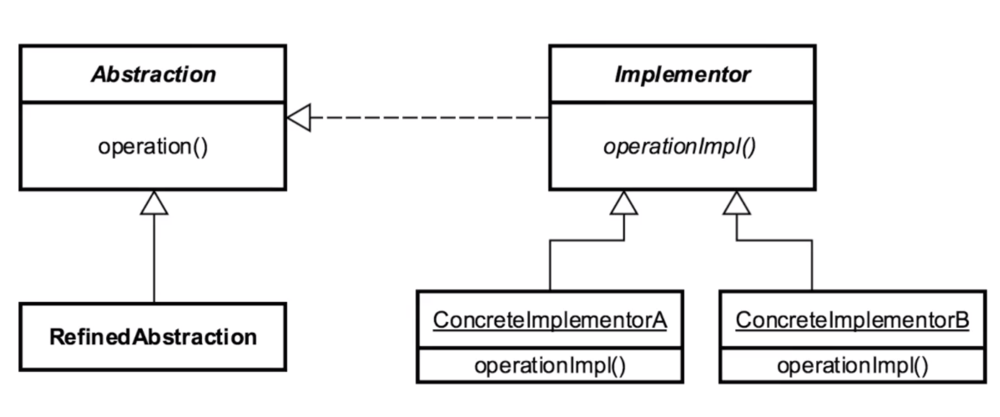

# Bridge 

## Introduction
Similar to adapter
- Bridge works w/ new code
- Adapter works w/ old code

## Concepts
- decouple abstraction and implementation
    - encapsulation
    - composition
    - inheritance
- changes in abstraction won't affect client
    - decouples implementation from contract (or
    interface) that the client is using.
- we know details won't be right
    - allows changes to be made w/o being a breaking
    change
    
EXAMPLES
- drivers
- JDBC

## Design Considerations

- interfaces and abstract base classes
- emphasizes composition over inheritance
    - more than composition
- expect change from both sidesk

- components
    - Abstraction
        - interface
    - Refined Abstraction 
        - specific implementation of interface
    - Implementor
        - hierarchy of abstract classes
    - Concrete Implementor
        - concrete impl of abstract base classes
        - used composition to implement bridge

## Pitfalls
- increases complexity
- you have to look at the code and PLAN what makes sense to abstract/separate
- conceptually difficult to plan
- MORE than "just good Object Oriented patterns".

## Contrast to Other Patterns

 ADAPTER | BRIDGE |
| --- | --- |
| Works after code is designed   legacy  | designed upfront/  built in advance |
| retrofitted | Abstraction/Implementation are allowed to vary |
| provides different interface than   originally intended| complex| 

Both adapt multiple systems.

## Summary
- design for uncertainty
- can be complex
- provides considerable flexibility
    - this is a tradeoff... added complexity for
    extremely powerful flexibility
- MUCH MORE THAN COMPOSITION.