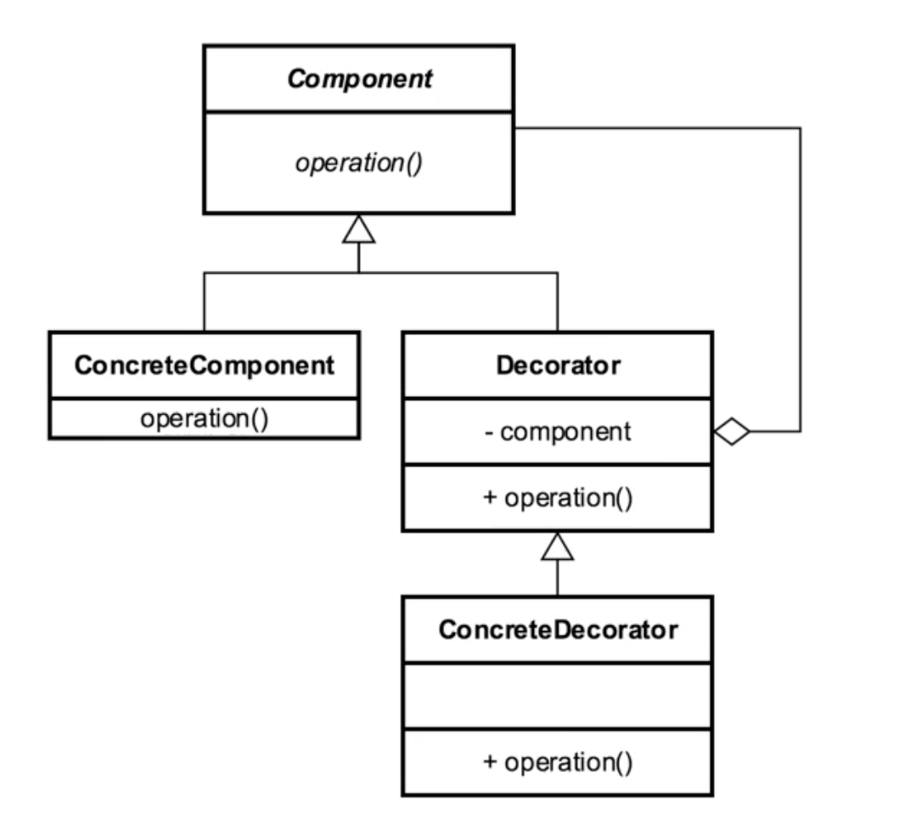

# Decorator

## Introduction
- hierarchical pattern that builds functionality at each level
- uses Composition

## Concepts
- aka wrapper
- add behavior w/o affecting other parts of hierarchy
- MORE than justs basic inheritance
    - complimentary rather than supplementary
- Single Responsibility Principle
    - do one thing and do it well
- behavior can be composed dynamically

EXAMPLES
- java.io.InputStream
- java.util.Collections#checkedList (so so example)
- most UI Components in awt and swing APIs

## Design Considerations

- inheritance based
    - uses composition (has-a) and inheritance(is-a) together to achieve
    desired result
- alternative to subclassing
    - decorators adhere to Single Responsibility Principle
- constructor requires instance of component FROM hierarchy
    - uses composition

COMPONENT
- interface/ABC

CONCRETE COMPONENT
- concrete impl of component
- target of decoration

DECORATOR
- base/wrapper

CONCRETE DECORATOR
- other decorators extend from decorator

COMPOSITION:  
- this is how the decorator HAS-A component to decorate

INHERITANCE
- this is how concrete implementations add functionality

NOTE: 
- decorator and concretecomponent must both extend the COMPONENT to 
inherit the same properties/behavior

## Pitfalls
- you build a new class for every feature you want to add
    - multiple little objects
- confused w/ simple inheritance

## Contrast to Other Patterns

| COMPOSITE | DECORATOR |
| --- | --- |
| Tree Structure | Contains another entity (composition), not composite| 
| Leaf and Composite have same interface to client | modifies behavior of the contained entity| 
| Unity between objects | doesn't change underlying object| 

## Summary
- original object stays the same
- interesting/unique way to add functionality
- often confused w/ inheritance
    - base object isn't changed though
- can increase complexity for clients