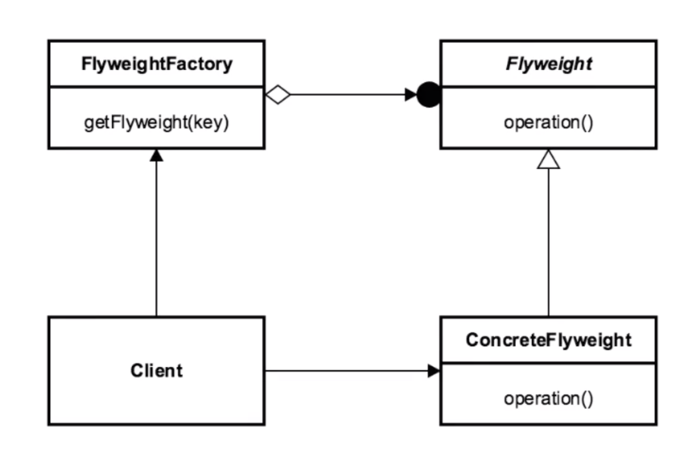

# Flyweight 

## Introduction
minimizes memory use by sharing data w/ similarly typed objects

## Concepts
- perf/resource optimization (efficient use of memory)
- large number of similar objects
- immutable objects
    - most of object states can be extrinsic
        - not essential or inherint

EXAMPLES:
- java.lang.String (String literal pool is a Flyweight factory)
- java.lang.Integer#valueOf(int)

## Design Considerations

- pattern of patterns
- utilizes a factory to retrieve flyweight objects after being created
- encompasses Creation and Structure

FLYWEIGHT FACTORY 
- returns a cached object (if exist) or a new flyweight object

FLYWEIGHT
- interface/abstraction for concrete flyweight

CONCRETE FLYWEIGHT
- what gets returned to the client

CLIENT
- entity requesting the flyweight object
- requests it from a flyweight factory

## Pitfalls
- complex pattern
    - lots of moving parts
    - internal Factory
- not "typically" a refactoring pattern due to complexity 
- can be seen as "premature optimization"
- MUST understand Factory
- "not a graphical pattern"

## Contrast to Other Patterns

| FLYWEIGHT | FACADE |
| --- | --- |
| Memory Optimization | | 
| Optimization Pattern | Refactoring Pattern | 
| Immutable Objects | |
| Thought of up front| After the fact |  
| | Simplified Client | 
| abstracts pattern from client. | provides a different interface |

## Summary
- great for Memory Management
    - great if we know we are going to have a lot of objects
- complicated pattern (usually requires up front design)
- Used a lot by the core API