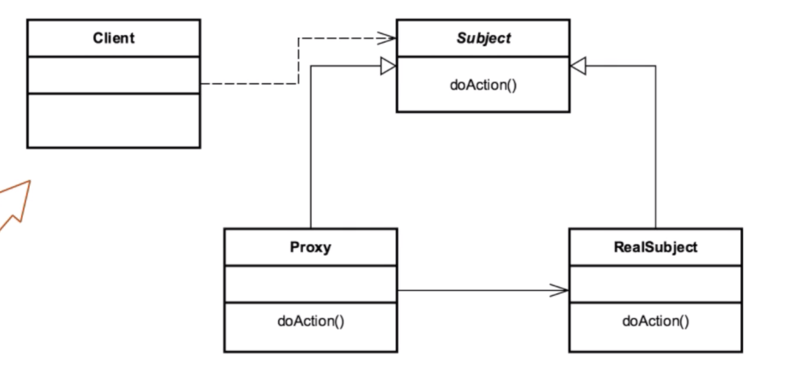

# Proxy 

## Introduction
A pattern that acts as an interface to something else
## Concepts
- create interface to object by wrapping it w/ a class to create that proxy
- "can" add functionality
- security, simplicity, remote, cost
- proxy is called to access real object

EXAMPLES
- java.lang.reflect.Proxy
- java.rmi.*

## Design Considerations

- intermediary object that intercepts calls
- interface based. 
- interface AND impl class (proxy resides in between)
- java.lang.reflect.Invocationhandler
- java.lang.reflect.Proxy

CLIENT
- Makes a reference call to an object/Subject

INTERFACE (SUBJECT/OBJECT)

PROXY
- intercepts call to object/subject and interacts w/ the implementation
- uses the invocation handler to intercept the call to the INTERFACE and makes
the call on behalf of the client.

IMPLEMENTATION (REAL SUBJECT) 
- TARGET, this is the object/subject we are making a reference call to.

## Pitfalls
- you can only have "One Proxy"
    - no chain/wrapping
- adds another abstraction layer
- very similar to other patterns 
    - makes it hard to identify

## Contrast to Other Patterns

| PROXY | DECORATOR |
| --- | --- |
| CAN add functionality, but not its main job| designed to add functionality | 
| Can only have one  | | 
| Compile Time | Runtime | 
| | Chained pattern |
| Intercepts calls to a specific type | points to its own type | 

## Summary
- great utilities built into Java API
- only one instance
- used by DIJ/IOC Frameworks
    - Inversion of Control 
    - Dependency Injection
- great for abstracting remote calls

