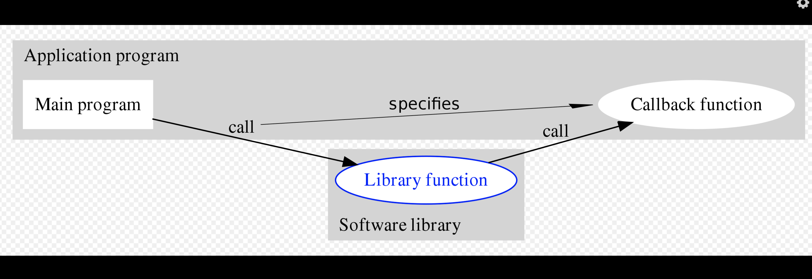

# Unified Stream Model

## CALLBACKS

- a callback is provided to a first-order function within some framework/library. 
- the callback itself is a function (hence making the function in the previous step
a higher-order function)
- however, it is the function we call() in the first step that actually executes this
function. 

Callback Downsides
- Callbacks only allow us to manage events one at a time. 

## TCP/HTTP Servers
- processing incoming data buffer from TCP/HTTP connections/requests isn't much 
different. 
    - a callback handler is declared that REACTS to each event, allowing for
    some degree of custom processing (within the callback)
    
## STREAMS
- "Unified Abstraction" presented by Vert.x that allows events to be managed as 
separate events, as opposed as IN SERIES.

READ STREAM
- a source of events that can be read
- EX: HTTP REQUEST

WRITE STREAM
- a destination for events to be sent. 
- EX: HTTP RESPONSE

### VERTX READ/WRITE STREAMS

| Stream Resource | Read | Write |
| --- | --- | --- |
| TCP Sockets | Yes | Yes |
| UDP Datagrams | Yes | Yes |
| HTTP Request/Response | Yes | Yes |
| WebSockets | Yes | Yes | 
| Files | Yes | Yes | 
| SQL Results | Yes | No | 
| Kafka Events | Yes | Yes | 
| Periodic Timers | Yes | No |

io.vertx.core.streams package defines streams interfaces
- ReadStream
- WriteStream

They have 2 main components
- essential methods for reading/writing data
- BACK-PRESSURE management methods. 

### ReadStream Essential Methods

| Method | Description |
| --- | --- | 
| handler(Handler<T>) | Handles a new read value of type T (i.e. Buffer, byte[], JsonObject, etc |
| exceptionHandler(Handler<Throwable>) | Handles a read exception | 
| endHandler(Handler<Void>) | Called when the stream has ended (either all data has been read, or an exception occurred) |

### WriteStream Essential Methods
| Method | Description |
| --- | --- |
| write(T) | Writes some data of type T (i.e. Buffer, byte[], JsonObject) | 
| exceptionHandler(Handler<Throwable>) | Handles a write exception | 
| end() | Ends the stream | 
| end(T) | writes some data of Type T, then ends the stream |
