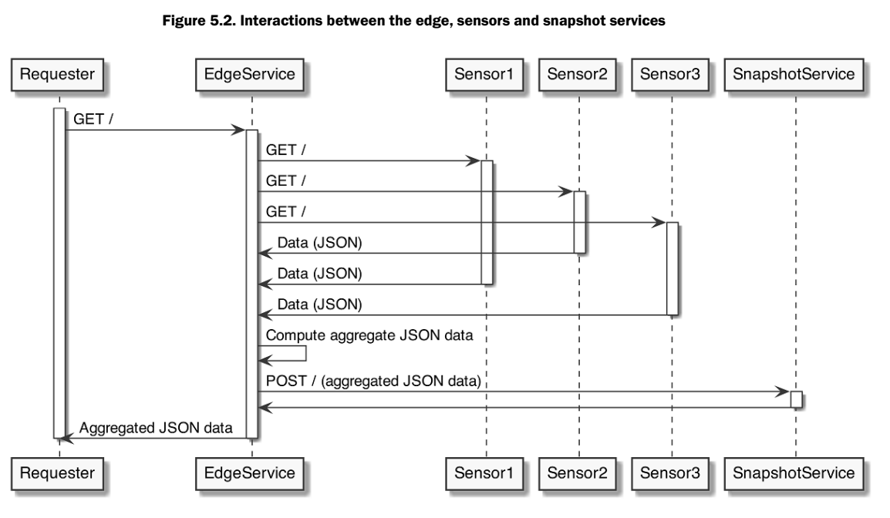

# Edge Service
(A.k.a API Gateway)
- this is a service that serves as a facade to other services
- requesters have to deal w/ just one service interface rather than each one of
the services. 
    - other tasks
        - data transformation
        - proxying other services.  

