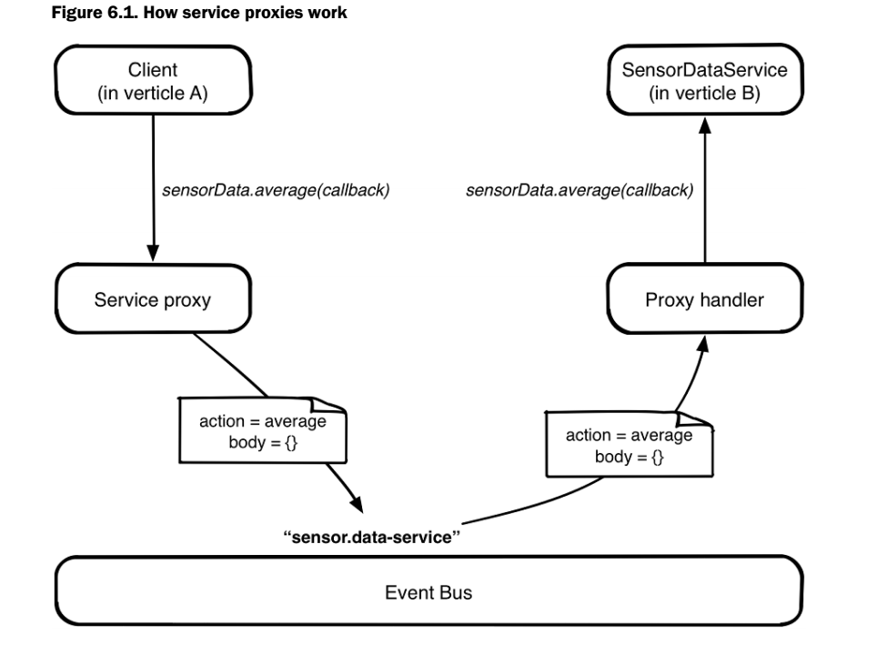

# Asynchronous RPCs
Vert.x event-bus services are more or less an Async RPC
- service encapsulates a set of operations
    - i.e. like SensorDataService
- service is described by a standard Java API
    - i.e. w/ methods exposed for client operations
- requester and impl don't need to deal directly w/ event-bus messages. 

## Service Proxy Design
