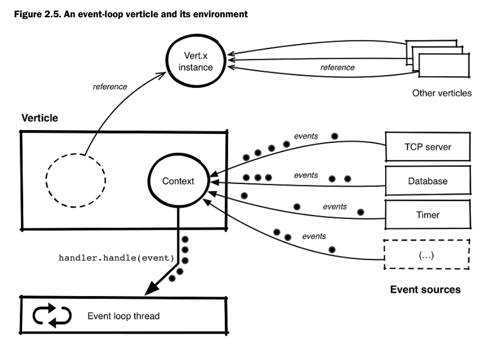

# Verticle Guts

## Verticle
a Combination of 2 objects
- the Vert.x instance it belongs to
- a dedicated context instance that allows dispatching events to handlers. 

The instance is responsible for exposing the core APIs for the purposes of declaring
event handlers. 
- setTimer()
- setPeriodic()
- createHttpServer()
- deployVerticle()

## Vert.x Instance
- single instance shared by multiple verticles
- (usually) only 1 instance per JVM process

### CONTEXT instance

- holds access to the threads for executing handlers. 
- events come from all over:
    - timers
    - db drivers
    - HTTP servers
- events are usually being triggered from OTHER threads

- event handling in user-defined callbacks happens through the context. 
- the context allows calling handler back on the verticle event-loop thread. 

### Worker Verticles
pretty much the same as a normal vertx instance
- handlers are executed using ONE worker thread in a worker thread pool
- still "Verticles" like event-loop counterparts
- still can assume single-threaded access. 

- DIFFERENCE: no guarantee on WHICH worker thread is going to be used for processing
events.